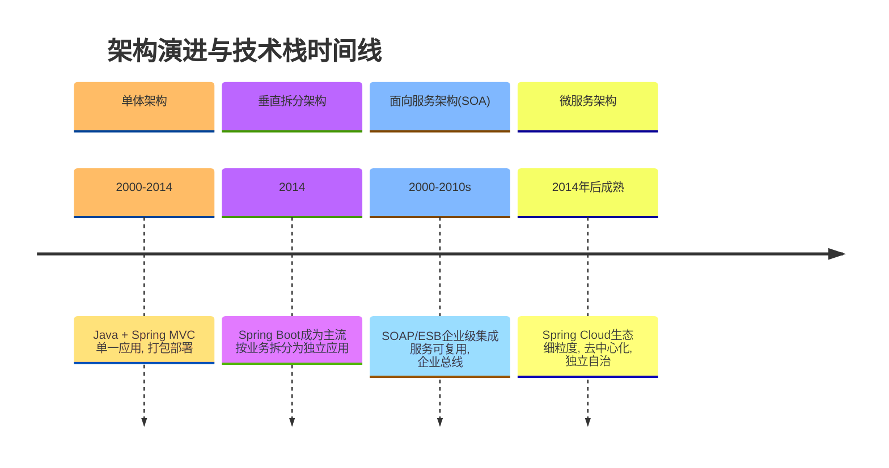
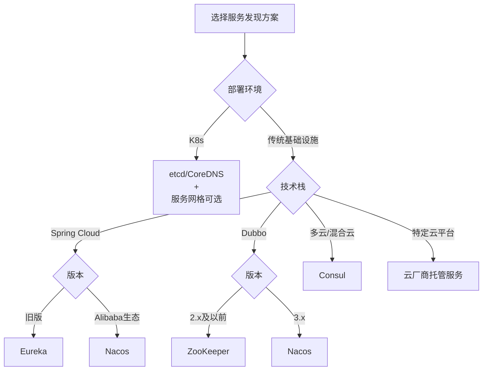
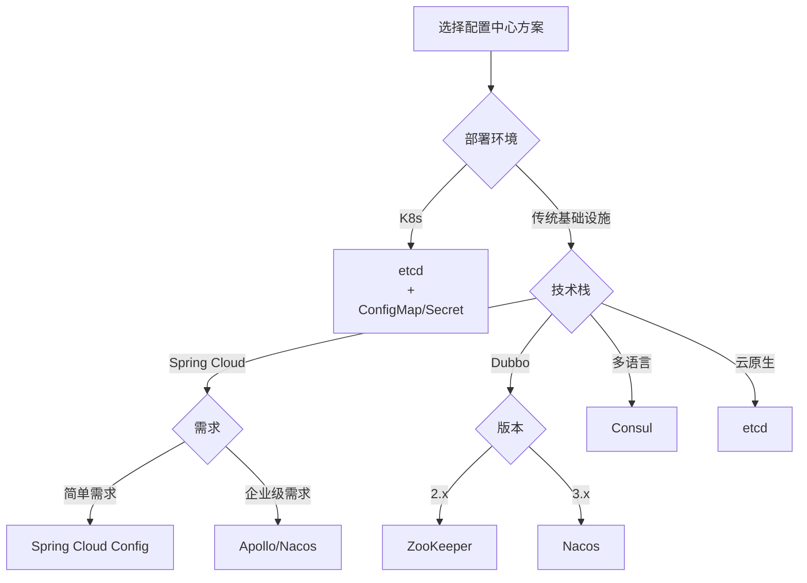
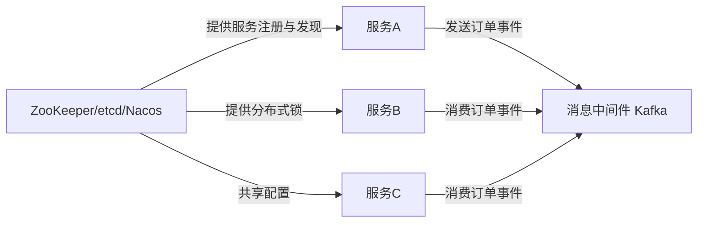

# 分布式系统基础设施全景

[[toc]]

## 分布式系统演进路径

想象一下，你要盖一个房子。

### 单体应用架构：一栋大别墅

这就像**盖一栋大别墅**，所有功能都塞在一个大房子里。

- **特点**：整个系统（用户管理、商品展示、订单处理、支付功能）像一个大包裹，都运行在一个Java程序（进程）里，用**一个数据库**存所有数据。
- **技术栈**：**Java + Spring MVC** 框架来写代码，用 **MySQL** 存数据，打包成一个 `xxx.war` 文件，部署到 **Tomcat** 这样的应用服务器上。
- **挑战**：代码耦合严重，扩展困难，部署风险高
    - **改一处而动全身**：想装修厨房（改用户模块），可能得惊动整个房子（需要全站重新测试和部署）。
    - **难以扩建**：访问量大了，只能把整栋别墅原样复制一栋（**整体扩容**），很浪费。
    - **技术栈单一**：全家都得用同一种装修风格（技术框架），想换个新潮的卫生间（新技术）很难。

> **（打个比方）** 这就好比一个“校园信息管理系统”，登录、选课、查成绩、缴费所有功能都做在一个网站里。

### 垂直拆分架构：联排别墅

别墅太大不好管理？那就把它拆成**几栋功能独立的联排别墅**。

- **特点**：按核心业务把大系统拆成几个独立小系统，比如拆成“用户中心”、“商城系统”、“订单系统”。每个小系统**自己有自己的数据库**，不跟别人共用。
- **技术栈**：每个系统都像一个小单体，用 **Spring Boot** 快速搭建，系统之间直接打电话沟通（通过 **HTTP 接口** 或简单的 **RPC** 互相调用）。
- **挑战**：应用间存在重复功能，数据一致性管理复杂
    - **功能重复**：每栋别墅都得自己建车库、装宽带（每个系统都要实现自己的用户登录、权限检查），重复劳动。
    - **数据不一致**：A别墅说“货已发出”，B别墅的库存可能还没减掉，对不上账。
    - **调用关系混乱**：别墅之间互相打电话求助，关系网变得复杂，维护起来头疼。

> **（打个比方）** 现在变成了“选课系统”、“成绩查询系统”、“缴费系统”三个独立网站，但学生登录三个系统需要记三套账号密码。

### 面向服务架构（SOA）：成立一个“社区服务中心”

联排别墅各自为政效率低？那就成立一个强大的社区服务中心（ESB企业服务总线）来统一协调。

- **特点**：把各个系统中可共用的核心能力（比如“用户信息服务”、“支付服务”）抽出来，做成标准的“公共服务”。所有系统**不直接联系**，必须通过“服务中心”来申请和使用这些服务。
- **核心组件**：
    - **服务中心 (ESB)**：像居委会大妈，负责登记服务、转发请求、转换格式（是核心，但也最复杂）。
    - **服务目录 (如 UDDI/ESB内置目录)**：服务的“电话簿”，方便查找。
    - **公告栏 (消息中间件如 ActiveMQ)**：作为ESB的补充，用于在服务间发布通知和事件，实现异步解耦的通信模式。(注：这类消息中间件是通用的通信基础设施，在后来的微服务架构中演变为更核心的组件。)
- **挑战**：
  - “服务中心”权力太大，一旦它出故障或太忙，整个社区就瘫痪了。而且流程严格，开发部署不够灵活。
  - 服务治理复杂度增加，需要解决服务发现、负载均衡等问题

> **（打个比方）** 现在有了一个“校园统一身份认证中心”。所有系统都不自己管登录了，学生去任何一个系统，都会被引导到这个中心来验证身份。

### 微服务架构：专业化的“商业街区”

觉得“社区服务中心”太官僚、反应慢？那就升级成**自治、专业的“商业街区”**。

- **特点**：把系统拆得更细、更专业。每个小店（服务）只专注做好一件事（如“用户服务”、“订单服务”），**自己当家作主**（独立开发、部署、运行），用最合适的工具（技术栈），并通过统一的“商业街管委会”（API网关）对外服务。
- **核心组件**：
    - **管委会/前台 (API网关如 Spring Cloud Gateway)**：所有顾客（用户请求）都从这里进入，它负责指引你去哪家店。
    - **服务导航系统（服务注册与发现中心）**：如Nacos，是微服务的实时通讯录，确保服务能随时找到彼此。
    - **店长手册 (配置中心如 Apollo/Nacos)**：统一管理所有店的营业规则（配置）。
    - **街区协调员 (分布式协调服务如 ZooKeeper)**：为整个系统提供一致的配置、锁和选举等底层协调能力。
    - **街区监控 (分布式追踪如 Zipkin)**：追踪一个顾客在整条街的消费路径，出了问题好排查。
    - **标准化集装箱 (容器化 Docker)**：每家店的商品（服务）都打包进标准的集装箱，运输和上架极其方便。
    - **高效物流 (消息中间件如 Kafka)**：店与店之间用高效的物流车（消息队列）传递单据，不用互相等待。
    - **公共储物柜 (分布式缓存如 Redis)**：是所有服务共享的性能加速层。
- **挑战**：店太多，管理复杂；跨店消费（分布式事务）如何保证要么全成功要么全失败，是个难题；监控整个街区的健康状况也需要更精细的工具。

> **（打个比方）** 现在，“选课”是一个独立服务，“成绩计算”是另一个，它们通过API网关对外提供接口，并且各自用最适合自己的数据库。

### 云原生架构：智能、弹性的“未来城市”

商业街区已经很好，但想要更智能、更自动化？这就是**运行在云上的“未来城市”**。

- **特点**：它**基于微服务**，但用上了全套的云技术和自动化理念。城市（应用）本身就是为云（动态环境）而生的。
- **核心组件**：
    - **新一代城市门户 (云原生网关如 APISIX)**：更强大、更动态的API网关。
    - **城市管理AI (容器编排 Kubernetes)**：自动决定把集装箱（容器）放在哪台服务器最合适，坏了自动替换，忙了自动开新店。
    - **智能交通系统 (服务网格如 Istio/Linkerd)**：在每条街道（服务间网络）下铺设智能管道，自动处理安全、流量控制和监控，店铺（服务）自己不用操心。
    - **城市全景监控中心 (可观测性平台 Prometheus+Grafana+Jaeger)**：用度量、日志、链路追踪三维一体，实时洞察城市每一个角落的健康状况。
    - **云原生基础设施 (云原生数据库如 TiDB/CockroachDB)**：像城市的公用事业，天生就具备弹性伸缩、高可用的能力。
- **优势**：**弹性伸缩**（客流高峰自动扩容）、**高可用**（任何店铺故障不影响主街运行）、**快速部署**（集装箱秒级上线）、**自动化运维**（AI管理，极大减少人工）。

> **（打个比方）** 整个校园数字系统完全基于K8s部署，流量大时自动扩容考试服务，服务间通信由Istio自动加密和治理，运维人员通过 Grafana 大屏一目了然。

### 逻辑演进与历史时间线

值得注意的是，架构的**逻辑演进顺序**与它们成为主流的**历史时间顺序**并不完全一致：
*   **逻辑上**，我们常理解为：`单体 → 垂直拆分 → SOA → 微服务 → 云原生`。这体现了从“物理拆分”到“服务抽取”再到“彻底自治”的思维深化过程。
*   **历史上**，如时间线所示，`SOA（2000s）`作为企业级集成的重型方案，其主流实践早于基于Spring Boot的轻量级`垂直拆分（2014）`的流行。这是因为SOA所需的重型技术和规范，最初主要服务于大型企业集成；而轻量级的垂直拆分，直到Spring Boot等工具大幅降低开发复杂度后，才在互联网领域广泛普及。

这种错位正说明，**一项技术或架构的流行，不仅取决于其思想的先进性，更取决于其实现成本是否降到了市场可广泛接受的水平。**

**总结一下演进思路**：
架构的演进并非一条单纯的直线，而是技术与需求交织的复杂路径。它整体上遵循从 **“大而全的单体”** 到 **“小而专的分布式服务”** 的总体趋势，但具体实践受限于时代的技术成本。

*   **从“单体”到“服务化”**：首先，为了应对企业内部的复杂集成（SOA，2000s）或互联网业务的快速拆分需求（垂直拆分，2014），架构从单体中分离出来。
*   **从“中心化治理”到“去中心化自治”**：早期的服务化（SOA）强调通过**中心化的总线（ESB）进行统一治理**；而后续的演进（微服务，2014后）则转向**去中心化的、智能的云平台（K8s, 服务网格）**，追求极致的服务自治与团队敏捷。
*   **核心驱动力**：每一步演进都旨在解决**扩展性、开发效率、系统可靠性**等方面的痛点，而每一次普及都得益于**新技术的成熟将原有模式的门槛大幅降低**（如Spring Boot之于垂直拆分，Docker/K8s之于微服务和云原生）。

## 核心概念与架构模式
构建现代分布式系统（尤其是云原生微服务架构）需要一套分层、协同、可组合的基础设施体系。这些组件共同解决分布式环境下的**通信、协调、治理、可观测、安全、部署**等核心挑战。

我们可以将它们划分为两大平面（Plane）——控制平面（Control Plane）与数据平面（Data Plane），同时需关注两类重要补充：一是部分系统采用控制/数据分离架构（如服务网格、容器编排平台），其内部明确拆分为两个平面；二是横切关注能力（如可观测性、安全），它们贯穿所有组件，无法被单一平面完全涵盖。
+ 控制平面（Control Plane）：管理系统元数据、状态、策略
  - 分布式协调服务：多个节点如何就集群状态达成一致？如何选举主节点？如何实现分布式锁？
  - 服务注册与发现（Service Registry & Discovery）：服务在哪里？
  - 配置中心（Configuration Center）：如何集中管理、动态推送配置？
  - 任务调度与批处理（Job Scheduler / Batch Processing）：如何定时或触发执行后台任务？
+ 数据平面（Data Plane）：处理业务数据流动与存储
  - 消息中间件：如何可靠、高效地在服务之间传递数据或事件？
  - API网关/服务网关（API Gateway）：如何统一接入、路由、治理流量？<Tip>南北向流量代理</Tip>
  - 分布式缓存（Distributed Cache）：如何加速数据访问、减轻数据库压力？
  - 分布式存储（Distributed Storage）：如何存储海量、高可用、强一致的数据？
+ 控制/数据分离结构
  - 服务网格（Service Mesh）：如何透明地实现服务间通信治理？
    * 控制面：策略下发中心
    * 数据面：<Tip>东西向流量代理</Tip>
+ 横切关注
  - 分布式追踪与可观测性（Observability）：系统是否正常？哪里慢？为什么错？
  - 安全与身份认证（Security & Identity）：谁可以访问？权限如何控制？

**架构组件分类表**

| 平面 | 类别 | 代表组件 |
|------|------|----------|
| 控制平面 | 分布式协调服务 | etcd, ZooKeeper, Consul |
|  | 服务注册与发现 | Nacos, etcd+自研发现逻辑, ZooKeeper, Consul,  Eureka |
| | 配置中心 | Nacos, etcd, Consul KV, Apollo, Spring Cloud Config |
| | 任务调度与批处理 | XXL-JOB, Elastic Job, Quartz, Airflow, K8s CronJob, Flink/Spark |
| 数据平面 | 消息中间件 | Apache Kafka, Redpanda, Amazon Kinesis, Apache RocketMQ, Apache Pulsar, RabbitMQ, ActiveMQ, NATS/JetStream, NSQ,Google Cloud Pub/Sub, Azure Service Bus |
|  | 分布式缓存 | Redis Cluster, Memcached, Alibaba Tair, AWS ElastiCache/Azure Cache for Redis |
|  | 分布式存储 | NewSQL: TiDB, CockroachDB   NoSQL: HBase, ScyllaDB, MongoDB, Neo4j   对象存储: MinIO, Ceph, AWS S3 |
|  | API网关/服务网关 | API网关：Kong, Apache APISIX, AWS API Gateway, Azure API Management 服务网关：Spring Cloud Gateway（常用作此角色）, Envoy |
| 控制/数据分离结构 | 服务网格 | Istio, Linkerd, Consul Connect, Dapr |
| | 容器编排与基础设施平台 | K8s, Nomad, Docker Swarm |
| 横切关注 | 分布式追踪与可观测性 | Metrics: Prometheus + Grafana, Micrometer, AWS CloudWatch/Azure Monitor   Logs: ELK, EFK, Loki + Promtail + Grafana   Traces: Jaeger, Zipkin, SkyWalking, OpenTelemetry |
| | 安全与身份认证 | OAuth2/OIDC授权服务器: Keycloak, Auth0, Dex   API认证: JWT, mTLS   密钥管理: HashiCorp Vault、AWS KMS、Azure Key Vault   RBAC/ABAC引擎: Casbin |

> 初创公司可能只需：K8s(容器编排平台) + Nacos(服务注册与发现) + RocketMQ(消息中间件) + Redis(分布式缓存) + SkyWalking(分布式追踪与可观测性)

> 大型企业可能需要：Istio(服务网格) + etcd(服务注册与发现) + Kafka(消息中间件) + TiDB(分布式存储) + Vault(安全与身份认证) + Jaeger(分布式追踪与可观测性) + Airflow(任务调度与批处理)

> K8s 是 Kubernetes 的缩写（“K” 和 “s” 之间有 8 个字母，故称 K8s），它是一个开源的容器编排平台。

> RocketMQ 内置协调，无需外置 ZK

> Envoy 也用作服务网格（如Istio）的默认数据面代理

## 控制平面

### 分布式协调服务

| 产品      | CAP                              | 数据模型             | 协议          | 生态集成                         | 补充说明                       |
| --------- | -------------------------------- | -------------------- | ------------- | -------------------------------- | ------------------------------ |
| Eureka    | AP                               | 服务注册表           | HTTP          | Spring Cloud Netflix             | 自我保护机制，已进入维护模式   |
| Zookeeper | CP                               | 树形ZNode            | ZAB           | Kafka Hadoop Dubbo | 运维复杂，逐渐被etcd替代       |
| etcd      | CP                               | KV存储               | Raft          | K8s Prometheus     | gRPC 接口，性能优于 ZK         |
| Consul    | AP/CP                            | KV + Service Catalog | Raft + Gossip | HashiCorp Nomad            | 内置健康检查、ACL、Mesh        |
| Nacos     | AP(注册中心) CP(配置中心) | 配置中心+服务发现    | Raft/Distro   | Spring Cloud Alibaba         | **国内主流，支持 DNS-F** |

**技术选型趋势演变**

+ **协议与生态演进**
  - **从 ZAB 到 Raft**：以 **ZooKeeper** 的 ZAB 协议为代表的自定义共识协议，逐渐被 **etcd** 采用的、更易理解和实现的 **Raft** 协议所取代，成为分布式协调领域的事实标准共识算法。
  - **从 HTTP 到 gRPC**：早期 **Eureka** 使用 HTTP 接口，而 **etcd v3** 等新一代协调服务全面转向性能更高、双向流支持更好的 **gRPC API**，提升了通信效率和集群交互能力。
  - **从专用客户端到云原生生态**：协调服务从绑定特定框架（如 **ZooKeeper** 之于 Dubbo/Hadoop），演进为 **K8s**、**服务网格** 等云原生架构的核心依赖（如 **etcd** 之于 K8s，**Consul** 集成服务网格），生态位从业务层下沉到基础设施层。
+ **架构模型与功能定位**
  - **从单一 CP 到模式可配**：早期 **ZooKeeper**、**etcd** 严格遵循 CP 模型以保证强一致性。后续的 **Nacos** 与 **Consul** 提供了更灵活的 **AP/CP 模式选择**，可根据服务发现（侧重可用性）或配置管理（侧重一致性）等不同场景进行权衡。
  - **从单一 KV/协调到一体化平台**：协调服务从提供单一的键值存储（**etcd**）或树形协调（**ZooKeeper**），向 **协调+服务发现+健康检查+配置**一体化平台 演进。**Consul** 内置服务目录，**Nacos** 融合注册与配置中心，代表了这一融合趋势。
  - **从独立组件到服务网格基石**：协调服务的基础能力（一致性存储、选举）正被整合为 **服务网格** 的底层基石。**Consul** 自身演进为服务网格，而 **Istio** 等可选择 **etcd** 作为其底层配置存储，协调服务的能力通过网格对应用透明化。
+ **部署与运维演进**
  - **从复杂自建到云托管服务**：早期企业需投入大量精力部署、调优和保障 **ZooKeeper**、**etcd** 集群的高可用。当前趋势是直接采用云厂商提供的 **全托管服务**（如阿里云 MSE 的 ZooKeeper/etcd、腾讯云 TSE），实现开箱即用与自动化运维。
  - **运维重心从“保稳定”到“提效能”**：随着托管服务的普及，运维核心从保障基础集群稳定性，转向如何利用协调服务的高级功能（如多数据中心复制、精细化 ACL 策略）来提升业务架构的效能与安全性。
+ **未来核心方向**
  - **服务网格标准化集成**：作为服务网格的数据平面或控制平面组件，其接口与生命周期管理将更深度地与 **K8s** 和 **服务网格标准**（如 SMI， Gateway API）集成。
  - **混合云与边缘协调**：支持跨公有云、私有云和边缘节点的 **统一、低延迟的服务发现与配置同步**，成为 **Consul** 等具备多数据中心能力的协调服务的关键发展方向。
  - **安全与可观测性增强**：**内置 mTLS、细粒度 RBAC/ACL 策略**，以及提供 **丰富的运行时指标与审计日志**，将成为下一代分布式协调服务的标准能力。

### 服务注册与发现

| 类型              | 产品                 | CAP模式 | 核心特点                                                       | 典型场景                       | 云厂商                                                                     |
| ----------------- | -------------------- | ------- | -------------------------------------------------------------- | ------------------------------ | -------------------------------------------------------------------------- |
| 传统微服务型      | Eureka               | AP模式  | 自我保护机制 HTTP API Spring Cloud Netflix集成     | Spring Cloud 微服务（旧版）    | 自托管 |
|                 | ZooKeeper            | CP模式  | 树形节点结构 强一致性 丰富的生态集成               | Dubbo 微服务 分布式协调依赖   | 阿里云 腾讯云ZK |
| 云原生/微服务型   | Nacos                | AP/CP双模式 | 服务发现+配置中心一体化 Spring Cloud Alibaba集成 DNS支持 | 微服务架构 配置动态更新     | 阿里云 腾讯云TDMQ 华为云CSE |
|                 | Consul               | AP模式  | 内置健康检查 多数据中心支持 ACL安全控制 服务网格集成         | 多区域微服务 服务网格集成     | 阿里云MSE 腾讯云TSE AWS App Mesh |
| K8s核心/基础设施型 | etcd                 | CP模式  | Raft协议 高性能KV存储 gRPC API                   | K8s 服务发现 自定义服务注册 | 阿里云MSE 腾讯云TSE Amazon EKS |
|                 | CoreDNS              | - | 插件化DNS服务器 K8s原生集成 配置灵活                     | K8s 服务发现 DNS解析    | 自托管 云厂商K8s服务内置 |
| 企业级全功能      | HashiCorp Consul     | AP模式  | 服务发现+健康检查+配置管理+服务网格 多数据中心支持 ACL安全机制     | 企业级微服务架构 混合云部署     | 自托管 |
| 云厂商托管型      | AWS Cloud Map(亚马逊)        | - | AWS原生服务发现 多命名空间 自动发现EC2/EKS资源                  | AWS 云原生应用 混合云服务发现   |                                                                            |
|                 | Azure Service Fabric（微软云） | - | 服务注册与发现+容器编排 微服务框架集成 自动缩放                   | Azure 微服务应用 容器化应用     |                                                                            |

**云原生时代的选择考量**

### 配置中心

| 类型              | 产品                 | 核心特点                                                       | 典型场景                       | 云厂商                                                                     |
| ----------------- | -------------------- | -------------------------------------------------------------- | ------------------------------ | -------------------------------------------------------------------------- |
| 云原生/微服务型   | Nacos                | 支持AP/CP双模式 服务发现+配置中心一体化 配置版本管理 灰度发布支持 | 微服务架构 配置动态更新     | 阿里云 腾讯云TDMQ 华为云CSE |
|                   | Consul               | 键值存储 多数据中心支持 配置版本控制 服务网格集成         | 多区域微服务 服务网格集成     | 阿里云MSE 腾讯云TSE AWS App Mesh |
| 传统微服务型      | Apollo               | 配置版本管理 灰度发布 权限控制 审计日志 Spring Cloud集成     | Spring Cloud 微服务 企业级配置管理    | 自托管 |
|                   | Spring Cloud Config  | Git作为配置存储 配置版本控制 与Spring Cloud生态深度集成     | Spring Cloud 微服务（旧版）    | 自托管 |
| 极简轻量型        | etcd                 | CP模式 Raft协议 高性能KV存储 gRPC API                   | K8s 配置存储 自定义配置中心 | 阿里云MSE 腾讯云TSE Amazon EKS |
|                   | etcd + 自研         | 基于etcd构建 轻量级 定制化强                               | 高并发场景 云原生应用配置     | 自托管 |
| 企业级全功能      | HashiCorp Consul     | 配置管理+服务发现+健康检查+服务网格 多数据中心支持 ACL安全机制     | 企业级微服务架构 混合云部署     | 自托管 AWS Secrets Manager（部分功能） |
| 云厂商托管型      | AWS AppConfig        | 全托管 配置验证 灰度发布 与AWS服务深度集成                  | AWS 云原生应用 配置动态更新   |                                                                            |
|                   | Azure App Configuration | 全托管 键值存储 功能标志 与Azure服务集成                   | Azure 微服务应用 配置管理     |                                                                            |

****

### 跨类别组件

各产品在微服务体系中的完整定位

| 组件 | 注册中心 | 配置中心 | 分布式协调 | DNS服务 | 特性 |
|------|---------|---------|-----------|---------|------|
| **Nacos** | ✅ | ✅ | ⚠️(有限) | ✅ | 一体化的微服务基础设施 |
| **Consul** | ✅ | ✅ | ⚠️ | ✅ | 服务网格友好，多数据中心强 |
| **etcd** | ⚠️(K8s专用) | ❌ | ✅ | ❌ | K8s生态核心组件 |
| **ZooKeeper** | ✅ | ❌ | ✅ | ❌ | 分布式协调专家 |
| **CoreDNS** | ⚠️(K8s专用) | ❌ | ❌ | ✅ | 纯粹的DNS解决方案 |

> ZooKeeper无原生服务发现能力，但可基于其树形ZNode结构和临时节点特性构建完整的服务注册与发现机制

> Consul设计时就内置了完整的分布式协调服务和发现功能

### 建议适用场景对照表

| 需求/场景                | 分布式协调服务推荐 | 服务注册与发现推荐     | 配置中心推荐          | 关键考虑                                      |
| ------------------------ | ------------------ | ---------------------- | --------------------- | --------------------------------------------- |
| **K8s 底座**      | etcd               | K8s Service + CoreDNS  | K8s ConfigMap + Secret | 原生集成，避免重复造轮子                      |
| **全新Spring Cloud项目** | Nacos              | Nacos                  | Nacos                 | 一体化方案，中文文档丰富，Spring Cloud Alibaba集成 |
| **Spring Cloud 微服务**  | Nacos/Eureka       | Nacos/Consul           | Nacos/Apollo          | 生态成熟，支持动态配置更新                    |
| **多数据中心服务发现**   | Consul             | Consul                 | Consul                | 多数据中心支持，服务网格友好                  |
| **强一致配置管理**       | etcd/ZooKeeper     | etcd(CP模式)/Nacos(CP模式) | etcd(CP模式)/Nacos(CP模式) | 数据一致性优先，适合金融等关键场景            |
| **多语言微服务**         | Consul             | Consul/Nacos           | Consul/Nacos          | 语言无关，服务网格集成                        |
| **迁移现有系统**         | 保持原有(Eureka/ZK)| 保持原有或迁移到Nacos    | 保持原有或迁移到Nacos | 降低迁移风险，逐步过渡                        |
| **企业级权限与审计**     | -                  | -                      | Apollo/Nacos          | 细粒度权限控制，完善的审计日志                |
| **云原生应用**           | etcd               | K8s Service + CoreDNS  | K8s ConfigMap + Secret | 轻量化，云原生友好                            |
| **自托管部署**           | etcd/Consul        | Nacos/Consul           | Nacos/Apollo          | 完全控制，无厂商锁定                          |
| **云厂商托管**           | 云厂商ZK/etcd服务  | AWS Cloud Map/Azure Service Fabric | AWS AppConfig/Azure App Configuration | 运维简化，与云服务深度集成                    |

### 性能与规模考量补充

| 产品 | 建议规模 | 性能特点 | 运维复杂度 |
|------|---------|---------|-----------|
| **Nacos** | 中小到大型 | AP模式性能好，CP模式保证强一致性 | 中等 |
| **Consul** | 大型/企业 | 多数据中心性能优秀，服务网格集成 | 较高 |
| **etcd** | 超大(K8s) | 读写性能极高，专门优化 | 中等(托管服务简化) |
| **ZooKeeper** | 中小型 | 写性能有限，读性能优秀 | 较高 |
| **CoreDNS** | 任何规模 | 作为DNS服务器性能优秀 | 低 |
| **Spring Cloud Config**（配置中心） | 中小型 | 简单易用，性能一般 | 低 |
| **Apollo**（配置中心） | 大型/企业 | 配置推送延迟低，支持大规模集群 | 较高 |

### 技术选型趋势演变
+ 注册中心
  - **从Eureka到Nacos**：Spring Cloud Alibaba生态逐渐替代Spring Cloud Netflix
  - **从ZooKeeper到Nacos**：Dubbo 3.0开始推荐Nacos作为注册中心
  - **服务网格影响**：Istio/Consul等服务网格方案内置服务发现，改变了技术栈选择
+ 配置中心
  - **从Spring Cloud Config到Nacos**：Spring Cloud Alibaba生态逐渐替代Spring Cloud Netflix
  - **从Apollo到Nacos**：一体化方案更受青睐
  - **云原生影响**：K8s ConfigMap/Secret成为轻量级配置管理的首选

### 未来趋势观察

1. **服务发现与配置中心融合**：Nacos引领的一体化方案趋势
2. **K8s成为事实标准**：etcd/CoreDNS作为底层，上层可叠加服务网格
3. **云厂商锁定风险**：AWS Cloud Map等厂商特定方案便捷但可能锁定
4. **轻量化与专业化并存**：简单场景用轻量方案，复杂场景用全功能方案

## 数据平面

### API网关/服务网关（API Gateway）
API网关是分布式系统的入口点，负责统一管理、路由、保护和监控API流量（主要是南北向流量）。

| 类型              | 产品                 | 核心特点                                                       | 典型场景                       | 云厂商                                                                     |
| ----------------- | -------------------- | -------------------------------------------------------------- | ------------------------------ | -------------------------------------------------------------------------- |
| 云原生/高性能     | Apache APISIX        | 基于Nginx + LuaJIT 动态路由 插件化架构 高性能           | 微服务API管理 流量控制       | 阿里云 腾讯云TSE 华为云CSE |
|                   | Kong                 | 基于Nginx + Lua 插件丰富 API生命周期管理 企业级支持       | 多团队API管理 API市场         | 自托管 AWS API Gateway（类似） |
| Spring生态        | Spring Cloud Gateway | Spring Cloud集成 响应式编程 Filter链架构 易扩展           | Spring Cloud微服务 轻量级API网关 | 自托管 |
| 服务网格集成      | Istio Gateway        | 与Istio服务网格深度集成 统一策略管理 mTLS支持 流量加密       | 服务网格环境 东西向流量管理     | 自托管 云厂商K8s服务集成 |
| 云厂商托管型      | AWS API Gateway      | 全托管 Serverless集成 API密钥管理 监控告警               | AWS云原生应用 无服务器架构     |                                                                            |
|                   | Azure API Management | 企业级API管理 开发者门户 策略引擎 生命周期管理           | 企业级API治理 多系统集成       |                                                                            |

### 分布式缓存（Distributed Cache）
分布式缓存用于加速数据访问、减轻数据库压力，提高系统性能和可扩展性。

| 类型              | 产品                 | 核心特点                                                       | 典型场景                       | 云厂商                                                                     |
| ----------------- | -------------------- | -------------------------------------------------------------- | ------------------------------ | -------------------------------------------------------------------------- |
| 键值型缓存        | Redis Cluster        | 内存数据库 支持多种数据结构 高性能 主从复制 哨兵机制       | 会话缓存 热点数据加速 计数器     | 阿里云Redis 腾讯云Redis Amazon ElastiCache |
|                   | Memcached            | 简单键值存储 高性能 分布式架构 低延迟                   | 大规模缓存 简单数据存储       | 自托管 云厂商托管服务 |
| 企业级缓存        | Alibaba Tair         | 兼容Redis 持久化存储 混合存储 自动容灾                   | 金融级缓存 大规模应用         | 阿里云 |
| 分布式内存网格     | Hazelcast            | 内存数据网格 分布式计算 高可用 弹性扩展                 | 实时分析 分布式计算           | 自托管 云厂商托管服务 |
| 云原生缓存        | Dragonfly            | 兼容Redis 优化的内存使用 更高的吞吐量 低延迟             | 云原生应用 大规模缓存集群       | 自托管 |

### 分布式存储（Distributed Storage）
分布式存储用于存储海量、高可用、强一致的数据。

| 类型              | 产品                 | 核心特点                                                       | 典型场景                       | 云厂商                                                                     |
| ----------------- | -------------------- | -------------------------------------------------------------- | ------------------------------ | -------------------------------------------------------------------------- |
| NewSQL数据库      | TiDB                 | 分布式关系型数据库 水平扩展 强一致性 MySQL兼容          | 在线交易系统 海量数据存储       | 阿里云TiDB 腾讯云TiDB 自托管 |
|                   | CockroachDB          | 分布式关系型数据库 PostgreSQL兼容 全球分布式 自动修复       | 全球业务 多区域部署           | 自托管 云厂商托管服务 |
| NoSQL数据库       | MongoDB              | 文档型数据库 灵活schema 高可用 水平扩展                 | 内容管理 用户数据存储         | 阿里云MongoDB 腾讯云MongoDB Amazon DocumentDB |
|                   | HBase                | 列式存储 强一致性 高可用 大规模数据处理                 | 日志存储 时序数据             | 阿里云HBase 腾讯云HBase 自托管 |
| 对象存储          | MinIO                | 兼容S3 API 高性能 可扩展 企业级安全                     | 海量非结构化数据 云原生存储     | 自托管 云厂商托管服务 |
|                   | Ceph                 | 统一存储平台 块存储+文件存储+对象存储 高可用 开源        | 企业级存储平台 混合云部署       | 自托管 云厂商托管服务 |

### 消息中间件

| 类型              | 产品                 | 核心特点                                                       | 典型场景                       | 云厂商                                                                     |
| ----------------- | -------------------- | -------------------------------------------------------------- | ------------------------------ | -------------------------------------------------------------------------- |
| 日志 / 流式处理型   | Apache Kafka         | 高吞吐量 低延迟 分区 Exactly-once                           | 日志收集 事件溯源 流处理     | 阿里云 腾讯云CKafka Amazon MSK Azure Event Hubs(兼容) |
|                   | Redpanda             | C++实现 无ZooKeeper 兼容Kafka API                            | 替代 Kafka（低延迟、简化运维） |                                                                            |
|                   | Amazon Kinesis       | AWS原生流服务                                                  | 实时分析 IoT 数据管道         |                                                                            |
| 企业级事务型      | Apache RocketMQ      | 金融级事务消息 顺序消息 高可靠                               | 订单、支付、交易系统           | 阿里云 腾讯云TDMQ 华为云DMS                                  |
|                   | Apache Pulsar        | 分层架构（Broker + BookKeeper） 多租户 Geo-replication | 多团队共享 跨地域复制         |                                                                            |
| 传统企业级        | RabbitMQ             | AMQP 协议 灵活路由（Exchange/Queue） 插件丰富    | 任务队列 RPC 微服务解耦      |                                                                            |
|                   | ActiveMQ             | JMS 标准 协议多（AMQP/MQTT/OpenWire）                   | 传统 Java EE 系统集成          | Amazon MQ                                                                  |
| 轻量/嵌入型       | NATS/JetStream       | 极简 高性能 发布订阅                                         | IoT 微服务内部通信            |                                                                            |
|                   | NSQ                  | Go 编写 去中心化 水平扩展                                    | 实时消息推送 监控告警         |                                                                            |
| 云原生 / Serverless | Google Cloud Pub/Sub | 全托管 全球一致性 按量付费                                   | 事件驱动架构 跨服务通信       |                                                                            |
|                   | Azure Service Bus    | 企业集成 会话 死信队列                                       | 金融 ERP 系统对接             |                                                                            |

新型技术

| 技术           | 定位                         | 关系说明                                          |
| -------------- | ---------------------------- | ------------------------------------------------- |
| Apache Flink   | 流处理引擎（非消息中间件）   | 通常消费 Kafka/Pulsar 数据做实时计算              |
| Pravega        | 流式存储系统（由 Dell 开源） | 类似 Kafka + 分布式文件系统，支持长留存、自动分层 |
| Memphis.dev    | 开发者友好的消息平台         | 兼容 NATS，提供 UI、Schema 管理、DLQ 等企业功能   |
| EMQX           | MQTT 消息中间件（IoT 场景）  | 专为海量设备连接设计，支持规则引擎、桥接 Kafka    |
| Solace PubSub+ | 企业级事件代理               | 支持多种协议（JMS, MQTT, AMQP），用于金融、航空   |

### 建议适用场景对照表

| 需求/场景              | 推荐组件类型                  | 推荐产品/方案                  | 备选方案                     | 关键考虑                                      |
| ---------------------- | ----------------------------- | ------------------------------ | ---------------------------- | --------------------------------------------- |
| **API流量管理**        | API网关/服务网关              | Apache APISIX/Kong             | Spring Cloud Gateway/Istio Gateway | 南北向流量管理，安全控制，API生命周期管理    |
| **热点数据加速**       | 分布式缓存                    | Redis Cluster/Dragonfly        | Memcached/Hazelcast         | 内存数据库，高性能，支持多种数据结构          |
| **海量数据存储**       | 分布式存储                    | TiDB/CockroachDB（关系型）     | MongoDB/HBase（非关系型）    | 水平扩展，强一致性，数据持久化                |
| **非结构化数据存储**   | 对象存储                      | MinIO/Ceph                     | 云厂商对象存储服务           | 兼容S3 API，海量存储，高可用                  |
| **高吞吐日志/事件流**  | 消息中间件（流处理型）        | Kafka/Redpanda/Pulsar          | -                            | 处理大规模实时数据流，支持分区和持久化        |
| **金融级事务消息**     | 消息中间件（事务型）          | RocketMQ                       | -                            | 金融级可靠性，支持事务消息和顺序消息          |
| **微服务解耦**         | 消息中间件（轻量型）          | RabbitMQ/NATS                  | ActiveMQ                     | 灵活的路由策略，适合服务间解耦和异步通信      |
| **IoT设备接入**        | 消息中间件（IoT型）+ 流处理   | EMQX/Mosquitto+Kafka           | -                            | 专为海量设备连接设计，支持MQTT协议            |
| **云原生Serverless**   | 云原生消息中间件              | GCP Pub/Sub/Azure Service Bus  | AWS SQS/SNS                  | 全托管服务，与云原生架构深度集成              |
| **多团队共享+跨云**    | 消息中间件（多租户型）        | Pulsar                         | -                            | 多租户架构，支持跨地域复制和自动扩展          |
| **低延迟嵌入式**       | 消息中间件（轻量/嵌入型）     | NSQ/NATS                       | -                            | 极简设计，高性能，适合嵌入式和轻量级场景      |

## 组件对比与协作

### 消息中间件 VS 分布式协调服务
消息中间件（Message Middleware）和分布式协调服务（Distributed Coordination Service）是构建分布式系统时**两类不同但常协同工作的基础设施组件**。它们解决的问题、设计目标和使用场景有本质区别，但在实际系统中往往**紧密配合**。

#### 核心职责对比

| 维度               | 消息中间件                                                                    | 分布式协调服务                                                                        |
| ------------------ | ----------------------------------------------------------------------------- | ------------------------------------------------------------------------------------- |
| **主要目的** | **异步通信 & 解耦** 在服务之间可靠地传递消息（事件、命令、数据） | **状态协调 & 元数据管理** 在分布式节点间达成一致、共享状态、选举主节点等 |
| **关注点**   | 吞吐量、延迟、持久化、顺序性、可靠性                                          | 一致性（CP/AP）、可用性、选举、锁、配置同步                                           |
| **数据模型** | 消息队列 / 主题（Queue/Topic） 生产者 → 中间件 → 消费者              | 键值对（KV）或树形结构（ZNode） 所有节点读写同一份“协调状态”                 |
| **典型操作** | send(), publish(), consume(), ack()                                           | create(), get(), watch(), lock(), leader election                                     |

> ✅ 简单说：
> 
> - **消息中间件 = “传话的邮差”**（负责传递业务数据）
> - **协调服务 = “开会的主持人”**（负责统一大家的行为规则）

#### 典型交互关系（谁依赖谁？）

##### 协调服务 **支撑** 消息中间件的高可用架构

很多消息中间件**内部依赖协调服务**来实现集群管理：

| 消息中间件         | 依赖的协调服务                                                                        | 用途                                         |
| ------------------ | ------------------------------------------------------------------------------------- | -------------------------------------------- |
| **Kafka**          | ZooKeeper（旧版） **KRaft（新版本去 ZK）**                               | Broker 注册、Leader 选举、Partition 状态管理 |
| **RocketMQ**       | **自研（基于 DLedger/Raft）** （早期 NameServer 无协调，现支持 CP 模式） | Master 选举、配置同步                        |
| **Pulsar**         | **ZooKeeper + BookKeeper**                                                      | Broker 注册、Ledger 元数据管理               |
| **RabbitMQ**       | **无外部依赖**（通过 Erlang 集群协议）                                          | 节点发现、镜像队列同步                       |

> 🔍 结论：**协调服务是消息中间件“背后的大脑”**，用于维护集群元数据一致性。

##### 消息中间件 **消费** 协调服务的事件（较少见）

某些高级场景下，协调服务的状态变更会**触发消息通知**：

- Consul 支持 **Watch 机制**，当服务注册/健康状态变化时，可触发 HTTP 回调或脚本，进而**发送消息到 Kafka/RabbitMQ**。
- Nacos 的配置变更可通过 **Listener** 推送事件到消息队列，实现“配置驱动业务”。

> ⚠️ 这属于**应用层集成**，非底层依赖。

#### 协作模式（在业务系统中如何共存？）

在一个典型的微服务系统中，两者分工明确：

- **消息中间件**：处理 **业务数据流**（如“用户下单”、“支付成功”）
- **协调服务**：处理 **系统控制面**（如“哪个实例是主节点？”、“配置是否更新？”、“服务是否在线？”）

> ✅ 它们分别作用于系统的 **数据平面（Data Plane）** 和 **控制平面（Control Plane）**

#### 常见组合实践

| 场景            | 消息中间件      | 协调服务              | 说明                                           |
| --------------- | --------------- | --------------------- | ---------------------------------------------- |
| 大数据日志管道  | Kafka           | ZooKeeper（或 KRaft） | Kafka 依赖 ZK 管理元数据                       |
| 金融交易系统    | RocketMQ        | 自带 DLedger（Raft）  | RocketMQ 内置协调，无需外置 ZK                 |
| 云原生微服务    | RabbitMQ / NATS | etcd / Nacos          | 服务发现用 Nacos，异步解耦用 MQ                |
| K8s 生态 | ——            | **etcd**        | K8s 本身重度依赖 etcd，应用可选配 Kafka/Pulsar |
| 多云混合架构    | Pulsar          | ZooKeeper             | Pulsar 利用 ZK 实现跨地域复制协调              |

#### 总结：关系一句话概括

> **分布式协调服务为消息中间件提供“集群大脑”（元数据一致性），而消息中间件为业务系统提供“通信神经”（异步数据流）。二者在架构上正交，在实践中互补。**

它们不是替代关系，而是**分层协作**：

- 协调服务 → **保障系统自身稳定运行**
- 消息中间件 → **保障业务数据可靠流转**

在设计分布式系统时，通常**先选协调服务（如 etcd/Nacos）搭建控制面，再选消息中间件（如 Kafka/RocketMQ）搭建数据面**。

### K8s(容器编排与基础设施平台) VS Istio(服务网格)
一个形象的比喻是 “公路系统”：

+ **K8s 是 “国土与建设部”**：
  - 负责修建高速公路、桥梁、隧道（基础设施）。
  - 决定在哪里建城市（调度 Pod），城市之间如何铺设基础道路（Service网络）。
  - 确保物资（容器）能运送到位。

+ **Istio 是 “交通管理与交警部”**：
  - 不负责修路，但在所有已有的道路上部署了智能交通灯、摄像头、ETC关卡、路况指示牌。
  - 可以实施精细的交通管制（限流、分流）、确保特定车辆走特定路线（灰度发布）、对所有车辆进行实时追踪（可观测性）、强制要求所有车辆使用防弹运输（mTLS加密）。

#### 核心区别与互补关系

| 维度 | K8s | Istio |
|------|------------|-------|
| **核心职责** | 容器编排、调度、基础设施管理 | 服务间通信治理、流量管理、安全 |
| **关注层面** | 基础设施层 | 服务治理层 |
| **通信类型** | 提供基础网络（Service） | 增强服务间通信（东西向流量） |
| **部署方式** | 独立平台 | 可部署在K8s之上 |
| **架构模式** | 控制面+数据面（kube-apiserver+kubelet等） | 控制面+数据面（Pilot+Envoy等） |

#### 结论
它们确实有重叠（如都涉及网络），但解决问题层次不同。K8s 让服务能通信，Istio 让服务间的通信变得更优、更安全、更透明。

在大型企业中，K8s 作为稳固的底层基础设施，Istio 作为上层服务治理的“赋能层”，两者结合构成了云原生时代最强大的微服务运行和治理平台。而对于初创公司，直接上手 Istio 可能“杀鸡用牛刀”，从 K8s 开始是更务实的选择。

### 控制平面组件对比

| 组件 | 代表产品 | 核心功能 | 适用场景 | 优缺点 |
|------|---------|---------|---------|--------|
| **分布式协调服务** | etcd, ZooKeeper, Consul | 分布式一致性、选举、锁 | 集群管理、配置同步 | 优点：强一致性 缺点：运维复杂 |
| **服务注册与发现** | Nacos, Consul, Eureka | 服务位置管理、健康检查 | 微服务架构 | 优点：动态发现 缺点：依赖网络 |
| **配置中心** | Nacos, Apollo, Spring Cloud Config | 集中配置管理、动态推送 | 多环境配置、灰度发布 | 优点：集中管理 缺点：单点风险 |

### 数据平面组件对比

| 组件 | 代表产品 | 核心功能 | 适用场景 | 优缺点 |
|------|---------|---------|---------|--------|
| **API网关** | APISIX, Kong, Spring Cloud Gateway | 流量路由、认证授权 | 南北向流量管理 | 优点：统一入口 缺点：性能开销 |
| **消息中间件** | Kafka, RocketMQ, RabbitMQ | 异步通信、解耦 | 事件驱动、流量削峰 | 优点：解耦系统 缺点：增加复杂度 |
| **分布式缓存** | Redis, Memcached | 数据加速、减轻数据库压力 | 热点数据、会话管理 | 优点：高性能 缺点：数据一致性风险 |
| **分布式存储** | TiDB, MongoDB, MinIO | 海量数据存储、高可用 | 大规模数据、非结构化数据 | 优点：可扩展 缺点：运维复杂 |

## 分布式系统组件的演进趋势与展望

### 整体趋势分析
现代分布式系统组件越来越倾向于**平台化发展**，从单一功能工具向集成多种能力的平台转变。Consul就是这种趋势的典型代表，它不仅提供协调服务和发现，还内置了健康检查、服务网格等高级功能。

### 控制平面组件趋势
+ **服务发现与配置中心融合**：Nacos引领的一体化方案趋势
+ **从传统到云原生**：K8s成为事实标准，etcd/CoreDNS作为底层基础设施
+ **服务网格影响**：Istio/Consul等服务网格方案内置服务发现，改变了技术栈选择
+ **云厂商锁定风险**：AWS Cloud Map等厂商特定方案便捷但可能造成锁定

### 数据平面组件趋势
+ **消息中间件的专业化**：从通用型到针对特定场景优化（如高吞吐、金融级、轻量型）
+ **流处理与消息中间件协同**：Flink等流处理引擎与Kafka/Pulsar深度集成
+ **云原生与Serverless**：全托管、按量付费的消息服务成为新选择

### 未来展望
1. **组件边界模糊化**：控制平面与数据平面组件的功能逐渐融合
2. **K8s生态深度整合**：更多组件将原生适配K8s环境
3. **轻量化与专业化并存**：简单场景用轻量方案，复杂场景用全功能方案
4. **多语言与跨云支持**：组件将更加注重语言无关性和跨云部署能力