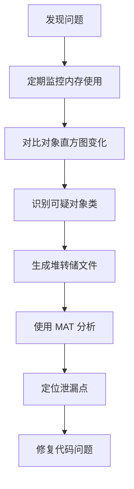

# jmap - JVM 内存分析工具

[[toc]]

## 工具概述

jmap（JVM Memory Map）是 JDK 内置的内存分析工具，用于生成堆转储文件、查看内存分配情况以及监控内存使用趋势。它是排查内存泄漏、分析对象分布和优化内存使用的核心工具，与 MAT（Memory Analyzer Tool）等分析工具配合使用，可以深度诊断各种内存问题。

**工具特点**：
- 无侵入性：不需要修改应用代码或配置
- 灵活多样：支持多种输出格式和分析模式
- 兼容性好：支持所有 JDK 版本
- 可集成性强：输出格式可被多种分析工具解析

**主要用途**：
- 生成堆转储快照（Heap Dump）
- 查看堆内存配置信息
- 分析对象分布和内存使用
- 监控内存分配趋势
- 排查内存泄漏问题
- 生成堆直方图（Histogram）

## 安装与基本使用

### 环境要求

jmap 随 JDK 提供，确保环境变量中配置了 `JAVA_HOME`，使其 `bin` 目录下的 jmap 可执行文件可在命令行中直接调用。

```bash
# 验证 jmap 是否可用
jmap -?

# 查看 JDK 版本
java -version
```

### 基本语法

```bash
jmap [options] <pid>
```

**常用选项**：

| 选项 | 说明 |
|-----|------|
| `-clstats` | 显示类加载器统计信息 |
| `-histo[:<histo-options>]` | 显示堆中对象统计信息（可选择只统计存活对象） |
| `-dump:<dump-options>` | 生成堆转储文件 |
| `-finalizerinfo` | 显示等待 finalize 的对象信息 |
| `-? -h --help` | 显示帮助信息 |

**dump-options 格式**：
```
live|all|format=b|file=<file>|gz=<number>
```
**histo-options 格式**：
```
live|all|file=<file>|parallel=<number>
```

> **注意**：
> - `-histo:live` 会暂停应用（STW），生产环境慎用！
> - 自 JDK 9 起，`jmap -F` 不再支持直接 attach 到运行中的进程，官方推荐使用 `jhsdb jmap` 替代以执行底层内存操作。

### 快速入门示例

```bash
# 查看进程 ID
jps -l

# 查看对象统计信息（包含已卸载的类）
jmap -histo 12345

# 查看存活对象统计
jmap -histo:live 12345

# 生成堆转储文件
jmap -dump:live,format=b,file=heapdump.hprof 12345

# 查看等待 finalize 的对象
jmap -finalizerinfo 12345
```

## 对象统计与直方图

### 生成对象直方图（-histo）

`-histo` 选项显示堆中所有对象的统计信息，包括对象数量、占用内存和类名。

```bash
# 生成对象直方图
jmap -histo <PID>
```

**输出示例**：

```
 num     #instances         #bytes  class name
----------------------------------------------
   1:          45678      3456789  [Ljava.lang.Object;
   2:          23456      1876543  java.lang.String
   3:          12345      1234567  [C
   4:           8765       987654  java.util.HashMap$Node
   5:           6543       654321  java.util.ArrayList
   6:           4321       456789  com.example.MyClass
   7:           3456       345678  java.util.concurrent.LinkedBlockingQueue
   8:           2345       234567  byte[]
   9:           1234       123456  java.lang.Class
  10:           1024        98304  java.lang.Thread
```

**列说明**：

| 列名 | 说明 |
|-----|------|
| #instances | 对象实例数量 |
| #bytes | 对象占用的内存总量（字节） |
| class name | 对象的完整类名 |

### 分析可疑对象类

```bash
#!/bin/bash
# find-memory-hog.sh - 找出内存占用最多的类

PID=$1
TOP_N=${2:-20}

if [ -z "$PID" ]; then
    echo "用法: $0 <PID> [TOP_N]"
    exit 1
fi

echo "=== 内存占用 TOP $TOP_N (进程: $PID) ==="
echo ""

# 获取对象直方图
jmap -histo $PID | head -n $((TOP_N + 7)) | tail -n $TOP_N

echo ""
echo "--- 分析建议 ---"

# 检查是否有异常增长的对象
TOP_OBJ=$(jmap -histo $PID | head -n 11 | tail -n 10 | awk '{if ($2 > 10000) print $3}')

if [ ! -z "$TOP_OBJ" ]; then
    echo "以下对象数量较多，建议检查:"
    echo "$TOP_OBJ"
fi
```

### 存活对象统计（-histo:live）

`-histo:live` 选项只统计存活对象（被 GC Roots 引用），会自动触发一次 Full GC。

> `-histo:live` 会暂停应用（STW），生产环境慎用！

```bash
# 只统计存活对象（会触发 Full GC）
jmap -histo:live <PID>
```

**使用场景**：
- 检测内存泄漏（存活对象持续增长）
- 定位无法回收的对象
- 评估 Full GC 后的内存状态

**注意事项**：
- 会触发 Full GC，可能造成应用暂停
- 生产环境慎用，建议在低峰期操作

## 堆转储生成与分析

### 生成堆转储文件（-dump）

`-dump` 选项生成堆内存快照文件，可被各种分析工具解析。

```bash
# 基本语法
jmap -dump:<dump-options> <PID>

# 示例：生成包含存活对象的堆转储
jmap -dump:live,format=b,file=heapdump.hprof <PID>

# 示例：生成完整堆转储（不触发 GC）
jmap -dump:format=b,file=full-heapdump.hprof <PID>

# 示例：强制生成转储（正常方式失败时）
jhsdb jmap --pid 33416 --dump-file=heapdump.hprof
```

**dump-options 说明**：

| 选项 | 说明 |
|-----|------|
| `live` | 只转储存活对象（触发 GC） |
| `format=b` | 二进制格式（HPROF） |
| `file=<file>` | 输出文件名 |
| `all` | 转储所有对象（包括已死的） |

### 堆转储文件名规范

建议使用以下命名规范：

```bash
# 格式：heapdump-<服务名>-<日期>-<时间>.hprof
heapdump-myapp-20241215-143022.hprof

# 带标注的示例
heapdump-myapp-OOM-20241215-143022.hprof
heapdump-myapp-FULLGC-20241215-143022.hprof
heapdump-myapp-MEMLEAK-20241215-143022.hprof
```

### 自动化堆转储脚本

```bash
#!/bin/bash
# auto-heapdump.sh - 自动堆转储脚本

PID=$1
OUTPUT_DIR=${2:-/tmp/heapdumps}
TIMESTAMP=$(date +%Y%m%d-%H%M%S)

if [ -z "$PID" ]; then
    echo "用法: $0 <PID> [output-dir]"
    exit 1
fi

# 创建输出目录
mkdir -p $OUTPUT_DIR

# 获取应用名称
APP_NAME=$(jps | grep $PID | awk '{print $2}')
APP_NAME=$(basename $APP_NAME .jar)

# 生成堆转储文件
DUMP_FILE="$OUTPUT_DIR/heapdump-${APP_NAME}-${TIMESTAMP}.hprof"

echo "=== 自动堆转储 ==="
echo "进程 ID: $PID"
echo "应用名称: $APP_NAME}"
echo "输出文件: $DUMP_FILE"
echo ""

# 生成堆转储（包含存活对象）
jmap -dump:live,format=b,file=$DUMP_FILE $PID

# 验证文件
if [ -f "$DUMP_FILE" ]; then
    FILE_SIZE=$(ls -lh $DUMP_FILE | awk '{print $5}')
    echo "✅ 堆转储生成成功: $DUMP_FILE ($FILE_SIZE)"
else
    echo "❌ 堆转储生成失败"
    exit 1
fi
```

### 条件触发堆转储

```bash
#!/bin/bash
# trigger-heapdump-on-condition.sh - 条件触发堆转储

PID=$1
THRESHOLD=${2:-90}  # 老年代使用率阈值（%）
CHECK_INTERVAL=${3:-60}  # 检查间隔（秒）

if [ -z "$PID" ]; then
    echo "用法: $0 <PID> [threshold] [interval]"
    exit 1
fi

echo "=== 条件触发堆转储监控 ==="
echo "监控进程: $PID"
echo "触发阈值: ${THRESHOLD}%"
echo "检查间隔: ${CHECK_INTERVAL}秒"
echo ""

while true; do
    # 获取老年代使用率
    OLD_USAGE=$(jmap -heap $PID 2>/dev/null | grep "Old Generation" -A 3 | grep "used" | awk '{print $3}')
    OLD_PCT=$(echo "$OLD_USAGE" | grep -oE "[0-9]+\.[0-9]+")
    
    # 获取堆内存总量
    TOTAL=$(jmap -heap $PID 2>/dev/null | grep "Old Generation" -A 3 | grep "capacity" | awk '{print $2}')
    
    echo "[$(date '+%Y-%m-%d %H:%M:%S')] 老年代使用率: ${OLD_PCT}%"
    
    # 检查是否达到阈值
    if [ $(echo "$OLD_PCT > $THRESHOLD" | bc) -eq 1 ]; then
        echo "⚠️  达到触发阈值，生成堆转储..."
        
        TIMESTAMP=$(date +%Y%m%d-%H%M%S)
        DUMP_FILE="/tmp/heapdump-triggered-${TIMESTAMP}.hprof"
        
        jmap -dump:live,format=b,file=$DUMP_FILE $PID
        
        echo "✅ 堆转储已生成: $DUMP_FILE"
        exit 0
    fi
    
    sleep $CHECK_INTERVAL
done
```

## 内存泄漏排查实战

### 内存泄漏特征识别

**内存泄漏的典型表现**：
- 老年代使用率持续增长
- Full GC 频率增加但内存无法释放
- 应用运行时间越长，内存占用越高

**jmap 检测方法**：

```bash
# Step 1：定期监控内存使用趋势
while true; do
    jmap -heap $PID | grep "Old Generation" -A 3
    sleep 60
done

# Step 2：对比不同时间点的对象直方图
jmap -histo:live $PID > histo-$(date +%H%M%S).log

# Step 3：生成堆转储进行深度分析
jmap -dump:live,format=b,file=heap-leak.hprof $PID
```

### 内存泄漏分析流程



### 与 MAT 集成分析

堆转储文件生成后，可以使用 Eclipse Memory Analyzer (MAT) 进行深度分析：

```bash
# 方法 1：命令行分析（需要 MAT 安装）
mat/bin/ParseHeapDump.sh heapdump.hprof

# 方法 2：生成报告
mat/bin/HeapDumpReader.sh heapdump.hprof --reportPath=/tmp/report/

# 方法 3：使用 Memory Analyzer Tool GUI
# 直接双击打开 heapdump.hprof 文件
```

**MAT 常用分析视图**：

| 视图 | 说明 | 用途 |
|-----|------|------|
| Leak Suspects | 泄漏疑点报告 | 自动检测可疑泄漏 |
| Dominator Tree | 支配树 | 找出占用内存最大的对象 |
| Histogram | 直方图 | 按类统计对象 |
| Top Consumers | 最大消费者 | 找出最大的对象 |
| OQL Console | OQL 查询 | 自定义查询 |

### 内存泄漏案例分析

**案例：静态集合导致的内存泄漏**

```java
public class CacheManager {
    // 静态 Map 不断增长，永不清理
    private static Map<String, Object> cache = new HashMap<>();
    
    public void addToCache(String key, Object value) {
        cache.put(key, value);  // 只添加，不清理
    }
}
```

**分析步骤**：

```bash
# 1. 生成堆转储
jmap -dump:live,format=b,file=cache-leak.hprof <PID>

# 2. 使用 MAT 分析
# 打开 heapdump.hprof，选择 "Leak Suspects Report"

# 3. 查找 HashMap$Node 对象
# Dominator Tree 中找到大量的 HashMap$Node

# 4. 追溯 GC Roots
# 发现被 static cache 字段引用

# 5. 定位代码位置
# 查看引用路径，找到 CacheManager.addToCache 方法
```

**解决方案**：

```java
// 方案 1：使用弱引用
private static Map<String, WeakReference<Object>> cache = new HashMap<>();

// 方案 2：定期清理
private static final int MAX_SIZE = 1000;
if (cache.size() >= MAX_SIZE) {
    // 清理最久未使用的条目
    // 或使用 LinkedHashMap 实现 LRU
}

// 方案 3：使用成熟缓存框架
private static Cache<String, Object> cache = CacheBuilder.newBuilder()
    .maximumSize(1000)
    .expireAfterAccess(30, TimeUnit.MINUTES)
    .build();
```

## 内存分配分析

### 分析对象分配来源

使用 jmap 分析对象分配模式和潜在的优化点：

```bash
# 查看大对象分配
jmap -histo:live <PID> | grep -E "^[0-9]+:" | awk '{if ($2 > 1000000) print}'

# 查找可疑的数组/字符串
jmap -histo <PID> | grep -E "(byte|\[C|\[Ljava)" | head -20
```

### 字符串优化分析

```bash
#!/bin/bash
# analyze-strings.sh - 分析字符串内存使用

PID=$1

if [ -z "$PID" ]; then
    echo "用法: $0 <PID>"
    exit 1
fi

echo "=== 字符串内存分析 (进程: $PID) ==="
echo ""

# 字符串对象统计
echo "--- String 对象统计 ---"
jmap -histo $PID | grep "java.lang.String"

# 字符数组统计
echo ""
echo "--- 字符数组统计 ---"
jmap -histo $PID | grep "\[C" | head -5

# 字符串对象占用比例
STRING_COUNT=$(jmap -histo $PID | grep "java.lang.String" | awk '{print $2}')
CHAR_ARRAY=$(jmap -histo $PID | grep "\[C" | awk '{sum += $2} END {print sum}')
TOTAL_HEAP=$(jmap -heap $PID | grep "used" | awk '{sum += $2} END {print sum}')

echo "String 对象数: $STRING_COUNT"
echo "字符数组总字节: $CHAR_ARRAY"

# 计算字符串内存占比
echo ""
echo "--- 字符串内存占比分析 ---"
```

### 对象大小估算

```bash
# 计算对象大概大小
# String 对象 ≈ 40字节 + 2字节 × 字符数
# ArrayList ≈ 40字节 + 4字节 × 元素数
# HashMap.Node ≈ 32字节 + 引用大小

# 估算 String 内存占用
STRING_OBJECTS=$(jmap -histo $PID | grep "java.lang.String" | awk '{print $2}')
CHAR_BYTES=$(jmap -histo $PID | grep "\[C" | awk '{sum += $2} END {print sum}')
STRING_ESTIMATE=$((STRING_OBJECTS * 40 + CHAR_BYTES))
echo "String 内存估算: $STRING_ESTIMATE 字节 ($(($STRING_ESTIMATE / 1024 / 1024)) MB)"
```

## 永久代/元空间分析

### JDK 8 以前：永久代分析

```bash
# 查看永久代统计
jmap -permstat <PID>
```

**输出示例**：

```
class loader         objects   bytes  parent loader   alive? type
<bootstrap>          1234      12.5M                null      live <bootstrap>
<internal>0x7f8c4c   567       5.6M    null            live java.net.URLClassLoader
```

### JDK 8 及以后：元空间分析

```bash
# 查看元空间使用情况
jmap -heap <PID> | grep -A 5 "Metaspace"
```

**元空间监控脚本**：

```bash
#!/bin/bash
# monitor-metaspace.sh - 监控元空间使用

PID=$1
INTERVAL=${2:-60}

if [ -z "$PID" ]; then
    echo "用法: $0 <PID> [interval]"
    exit 1
fi

echo "=== 元空间监控 ==="
echo "进程: $PID"
echo "监控间隔: ${INTERVAL}秒"
echo ""

while true; do
    METASPACE=$(jmap -heap $PID 2>/dev/null | grep "Metaspace" -A 10 | grep "used" | awk '{print $3}')
    METASPACE_PCT=$(jmap -heap $PID 2>/dev/null | grep "Metaspace" -A 10 | grep "used" | awk '{print $5}')
    
    echo "[$(date '+%H:%M:%S')] 元空间使用: $METASPACE ($METASPACE_PCT)"
    
    # 元空间告警
    if [ $(echo "$METASPACE_PCT > 85" | bc) -eq 1 ]; then
        echo "⚠️  元空间使用率超过 85%，请检查类加载情况"
    fi
    
    sleep $INTERVAL
done
```

## 等待 Finalize 对象分析

### 查看待 finalize 对象（-finalizerinfo）

```bash
# 查看等待 finalize 的对象
jmap -finalizerinfo <PID>
```

**输出示例**：

```
Num     #Objects         Class Description
-------------------------------------------------------
1123    1123             java.lang.ref.Finalizer
...
```

**分析要点**：
- 如果 Finalizer 队列持续增长，说明有对象在等待被 finalize
- 可能是 finalize 方法执行缓慢或对象创建速度过快

### Finalizer 相关问题排查

```java
// 问题代码示例
public class HeavyResource {
    @Override
    protected void finalize() throws Throwable {
        // 耗时操作
        Thread.sleep(10000);  // 10 秒的 finalize 操作
    }
}
```

```bash
# 排查步骤
jmap -finalizerinfo <PID>  # 查看队列长度

# 生成堆转储分析 Finalizer 引用链
jmap -dump:live,format=b,file=finalizer-dump.hprof <PID>

# 使用 MAT 分析 Finalizer 链
# 查找 java.lang.ref.Finalizer 引用的对象
```

## 强制转储与故障处理

### 强制生成转储（- jmap 命令F）

当正常无响应时，可以使用 `-F` 选项强制生成转储：

```bash
# 强制生成堆转储
jmap -F -dump:live,format=b,file=force-dump.hprof <PID>

# 强制查看堆信息
jmap -F -heap <PID>
```

**注意事项**：
- `-F` 使用 JVM 的 Attach API 的强制模式
- 可能会造成 JVM 临时停顿
- 在极端情况下可能仍会失败

### 进程无响应时处理

```bash
#!/bin/bash
# emergency-heapdump.sh - 紧急堆转储脚本

PID=$1

if [ -z "$PID" ]; then
    echo "用法: $0 <PID>"
    exit 1
fi

echo "=== 紧急堆转储 ==="
echo "尝试正常方式..."
jmap -dump:live,format=b,file=heapdump-normal.hprof $PID 2>/dev/null

if [ $? -ne 0 ]; then
    echo "正常方式失败，尝试强制方式..."
    jmap -F -dump:live,format=b,file=heapdump-force.hprof $PID
fi

# 使用 jcmd 作为备选方案
if [ $? -ne 0 ]; then
    echo "jmap 失败，尝试 jcmd..."
    jcmd $PID GC.heap_dump /tmp/heapdump-jcmd.hprof
fi
```

## 与其他工具集成

### jmap + jstat 联合监控

```bash
#!/bin/bash
# comprehensive-memory-monitor.sh - 综合内存监控

PID=$1
INTERVAL=${2:-5}

if [ -z "$PID" ]; then
    echo "用法: $0 <PID> [interval]"
    exit 1
fi

echo "=== 综合内存监控 ==="
echo "进程: $PID"
echo ""

while true; do
    echo "--- $(date '+%Y-%m-%d %H:%M:%S') ---"
    
    # GC 统计
    echo "--- GC 统计 ---"
    jstat -gcutil $PID | tail -1
    
    # 堆使用情况
    echo ""
    echo "--- 堆使用情况 ---"
    jmap -heap $PID 2>/dev/null | grep -E "(used|capacity)" | head -10
    
    # Top 对象
    echo ""
    echo "--- Top 10 对象 ---"
    jmap -histo $PID 2>/dev/null | head -n 12 | tail -n 10
    
    sleep $INTERVAL
done
```

### jmap + Prometheus 集成

```bash
#!/bin/bash
# export-jmap-metrics.sh - 导出 jmap 指标到 Prometheus

PID=$1
OUTPUT_FILE=/tmp/jmap-metrics.prom

# 获取堆指标
HEAP_INFO=$(jmap -heap $PID 2>/dev/null)

# 提取指标值
EDEN_USED=$(echo "$HEAP_INFO" | grep "Eden Space" -A 2 | grep "used" | awk '{print $2}')
EDEN_CAPACITY=$(echo "$HEAP_INFO" | grep "Eden Space" -A 2 | grep "capacity" | awk '{print $2}')
OLD_USED=$(echo "$HEAP_INFO" | grep "Old Generation" -A 3 | grep "used" | awk '{print $2}')
OLD_CAPACITY=$(echo "$HEAP_INFO" | grep "Old Generation" -A 3 | grep "capacity" | awk '{print $2}')
METASPACE_USED=$(echo "$HEAP_INFO" | grep "Metaspace" -A 2 | grep "used" | awk '{print $2}')

# 输出 Prometheus 格式
cat > $OUTPUT_FILE << EOF
# HELP jvm_heap_eden_used_bytes Eden space used bytes
# TYPE jvm_heap_eden_used_bytes gauge
jvm_heap_eden_used_bytes $EDEN_USED
# HELP jvm_heap_eden_capacity_bytes Eden space capacity bytes
# TYPE jvm_heap_eden_capacity_bytes gauge
jvm_heap_eden_capacity_bytes $EDEN_CAPACITY
# HELP jvm_heap_old_used_bytes Old generation used bytes
# TYPE jvm_heap_old_used_bytes gauge
jvm_heap_old_used_bytes $OLD_USED
# HELP jvm_heap_old_capacity_bytes Old generation capacity bytes
# TYPE jvm_heap_old_capacity_bytes gauge
jvm_heap_old_capacity_bytes $OLD_CAPACITY
# HELP jvm_metaspace_used_bytes Metaspace used bytes
# TYPE jvm_metaspace_used_bytes gauge
jvm_metaspace_used_bytes $METASPACE_USED
EOF

echo "指标已导出到 $OUTPUT_FILE"
```

## 最佳实践

```bash
# 生产环境最佳实践

# 1. 使用 -heap 进行常规监控（开销最低）
jmap -heap <PID> | grep "used"

# 2. 避免使用 -histo:live（会触发 Full GC）
# 生产环境使用普通 -histo 代替

# 3. 堆转储在低峰期进行
# 使用 cron 在凌晨低峰期自动执行
0 3 * * * /opt/scripts/heapdump.sh <PID> /data/heapdumps

# 4. 限制堆转储文件数量
# 脚本中自动清理旧文件
find /data/heapdumps -name "*.hprof" -mtime +7 -delete

# 5. 使用压缩减少存储
gzip /data/heapdumps/*.hprof
```

## 常见问题

### jmap 权限不足

```bash
# 检查进程用户
ps -ef | grep java

# 使用相同用户执行
sudo -u <username> jmap -heap <PID>

# 或修改 /proc/sys/kernel/yama/ptrace_scope
echo 0 | sudo tee /proc/sys/kernel/yama/ptrace_scope
```

### jmap 连接失败

```bash
# 检查进程是否存活
jps | grep <PID>

# 检查 JVM 是否支持 jmap
java -version

# 尝试使用 -F 选项
jmap -F -heap <PID>
```

### 堆转储文件过大

```bash
# 使用 gzip 压缩
gzip heapdump.hprof

# 或只转储存活对象（文件更小）
jmap -dump:live,format=b,file=heapdump.hprof <PID>
```

### jmap 和 jcmd 如何选择？

**jmap** 优势：
- 专为内存分析设计
- 对象直方图功能
- 详细的堆配置信息

**jcmd** 优势：
- 综合诊断工具
- 更多的操作选项
- 可以执行其他诊断命令

**建议**：常规使用 jmap，复杂场景配合 jcmd。

### 堆转储文件应该保留多久？

根据磁盘空间和需求决定：

| 场景 | 保留策略 |
|-----|---------|
| 生产环境 | 保留 7 天，自动清理 |
| 故障排查 | 保留 30 天 |
| 性能基线 | 长期保留 |

### 如何减少堆转储文件大小？

```bash
# 方案 1：只转储存活对象
jmap -dump:live,format=b,file=heapdump.hprof <PID>

# 方案 2：限制堆大小
java -Xmx512m ...  # 较小的堆生成的转储也更小

# 方案 3：使用在线分析工具
# 避免生成完整转储文件
```

### jmap 可以监控远程 JVM 吗？

jmap 本身不支持远程连接，但可以通过以下方式实现：

```bash
# 方式 1：使用 jcmd（支持远程）
jcmd <remote-pid> GC.heap_info

# 方式 2：配置 JMX 后使用 jstat
# 启动 JVM 时添加 JMX 参数
java -Dcom.sun.management.jmxremote.port=9010 ...

# 方式 3：使用 SSH 隧道
ssh -L 9010:localhost:9010 user@remote-host
jmap -J-Djava.rmi.server.hostname=localhost <PID>
```

## 相关资源

### 官方文档
- [jmap 官方文档](https://docs.oracle.com/en/java/javase/17/docs/specs/man/jmap.html)
- [HPROF 格式说明](https://docs.oracle.com/javase/8/docs/technotes/guides/troubleshoot/tooldescr007.html)

### 分析工具
- [Eclipse Memory Analyzer](https://eclipse.dev/mat/)
- [VisualVM 堆转储分析](https://visualvm.github.io/)

### 性能优化参考
- [Oracle Java 性能优化指南](https://docs.oracle.com/en/java/javase/17/perform/)
- [内存泄漏排查指南](https://www.baeldung.com/java-memory-leaks)

### 社区资源
- [Stack Overflow - jmap](https://stackoverflow.com/questions/tagged/jmap)
- [GitHub - Java 诊断工具](https://github.com/topics/jvm-diagnostics)

