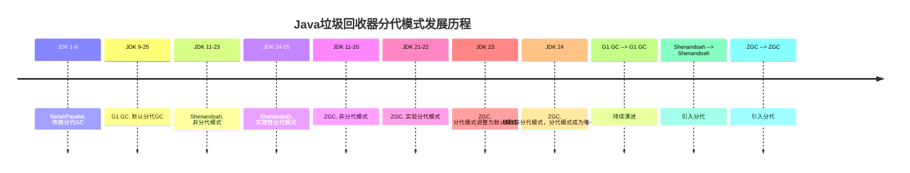

# Java 垃圾回收器详解

本部分详细介绍Java中的各种垃圾回收器，包括它们的工作原理、适用场景和调优参数。

## 垃圾回收器列表

### 分代垃圾回收器
分代垃圾回收器是基于对象生命周期不同阶段的内存管理策略，将堆内存划分为年轻代（Young Generation）和老年代（Old Generation），对不同代采用不同的垃圾回收算法。
现代GC（如G1）采用了更灵活的区域化分代模型，与传统设计不同。

#### 分代内存结构

- **年轻代（Young Generation）**：新创建的对象主要分配在这里，采用复制算法（Copying）。年轻代通常分为Eden空间和两个Survivor空间（S0和S1）。
- **老年代（Old Generation）**：长期存活的对象主要分配在这里，主要采用标记-清除或标记-整理等算法。
- **元空间（Metaspace）**：存储类元数据（如类信息、方法信息等）的区域，其垃圾回收主要针对不再使用的类元数据。

#### 传统分代垃圾回收器搭配关系

以下是Java中传统分代垃圾回收器的年轻代和老年代搭配关系表：

| 年轻代垃圾回收器 | 老年代垃圾回收器 | 特点 | 适用场景 |
|------------------|------------------|------|----------|
| Serial GC | Serial Old GC | 单线程收集，简单高效 | 单CPU环境，小型应用 |
| Parallel Scavenge | Parallel Old | 多线程收集，高吞吐量 | 多CPU环境，批处理应用 |
| ParNew | CMS (Concurrent Mark Sweep) | 低延迟，并发收集 | 响应时间敏感的应用 |

> 注意：虽然G1是区域化分代模型，Shenandoah和ZGC垃圾回收器也在较新版本中引入了分代概念，但它们不采用传统分代收集器的设计，因此不列入此搭配关系表。

#### 分代垃圾回收器搭配关系图表

以下是Java中主要分代垃圾回收器的搭配关系和发展历程图表：

> 注：图表展示了Java主要垃圾回收器的分代模式发展历程和搭配关系。Serial/Parallel代表传统分代垃圾回收器组合，G1虽然使用分代概念但基于区域布局设计，Shenandoah和ZGC最初为非分代设计，后在较新版本中引入分代模式以提升性能。

#### 垃圾回收器分代特性比较

| 垃圾回收器 | 分代特性 | 分代模式 | 主要特点 | JDK版本支持 |
|------------|----------|----------|----------|------------|
| Serial | 传统分代 | 强制分代 | 多线程年轻代收集器，单线程执行，内存占用小，适用于单CPU环境 | JDK 1.0+ |
| Serial Old | 传统分代 | 强制分代 | 单线程执行，内存占用小，适用于单CPU环境 | JDK 1.0+ |
| Parallel Scavenge | 传统分代 | 强制分代 | 年轻代，复制算法，多线程执行，高吞吐量，适用于多核服务器 | JDK 5+ |
| Parallel Old | 传统分代 | 强制分代 | 老年代，标记-整理算法，多线程执行，高吞吐量，适用于多核服务器 | JDK 5+ |
| ParNew | 传统分代 | 强制分代 | 多线程年轻代收集器，与CMS配合使用 | JDK 5+ (JDK 14移除) |
| CMS | 传统分代 | 强制分代 | 低延迟，并发标记和清除，与ParNew配合使用 | JDK 5+ (JDK 14移除) |
| G1 | 区域化混合 | 可选分代 | 平衡吞吐量和延迟，预测性回收 | JDK 7+、JDK 9+（server模式默认GC） |
| Shenandoah | 现代并发 | 实验性分代 | 极低延迟，并发压缩，分代模式提升性能 | JDK 24+（实验分代） |
| ZGC | 现代并发 | 默认分代 | 超大堆内存支持，亚毫秒级延迟，分代模式为默认 | JDK 21+（实验分代）、JDK 23+（默认分代）、JDK 24+（分代是唯一模式） |

> 注意：
> - 传统分代垃圾回收器（Serial/Parallel等）严格划分固定的年轻代和老年代区域
> - 现代垃圾回收器（G1/Shenandoah/ZGC）基于Region的内存布局，即使引入分代模式，也与传统分代设计有本质区别
> - Shenandoah和ZGC最初设计为非分代垃圾回收器，分代模式是较新版本中为提升性能而引入的增强特性

分代垃圾回收器的核心优势在于能够针对不同生命周期的对象采用不同的回收策略，提高垃圾回收效率，减少内存占用和CPU开销。

### G1 垃圾回收器
G1（Garbage-First）是一种面向服务端应用的垃圾回收器，旨在提供高吞吐量和低延迟的垃圾回收解决方案。它基于区域（Region）的内存布局和预测性回收策略。

[详细了解 G1 垃圾回收器](g1-gc.md)

### Shenandoah 垃圾回收器
Shenandoah是一个旨在提供极低延迟的垃圾回收器。它实现了完全并发的标记-压缩算法，大部分工作可以与应用程序并发执行。JDK 24中引入了实验性的分代模式，进一步提升了性能。

简要发展历程如下：

- JDK 11：Shenandoah 作为实验性功能首次引入，可通过一些OpenJDK构建版本使用（需特定构建，非所有OpenJDK11都默认包含）
- JDK 12：作为实验性功能并入 OpenJDK 代码库，但 Oracle 官方JDK12不包含此功能
- JDK 15：成为正式版本
- JDK 24：JEP 404 引入了实验性的分代模式，进一步提升了性能

[详细了解 Shenandoah 垃圾回收器](shenandoah-gc.md)

### ZGC 垃圾回收器
ZGC（Z Garbage Collector）也是一个旨在提供极低延迟的垃圾回收器，特别适合内存占用极大的应用程序。它支持TB级别的堆内存，实现了亚毫秒级的垃圾回收停顿时间。

简要发展历程如下：

- JDK 11：ZGC 作为实验性功能首次引入
- JDK 15：ZGC 成为正式版本
- JDK 21：JEP 439 引入了实验性的分代模式，进一步提升了性能
- JDK 23：JEP 474 分代模式调整为ZGC默认模式
- JDK 24：JEP 490 移除非分代ZGC，分代ZGC成为唯一选择

[详细了解 ZGC 垃圾回收器](zgc.md)

## 默认GC

| JDK 版本范围 | **Server 模式默认 GC** | **Client 模式默认 GC** | 核心变化说明 |
| :--- | :--- | :--- | :--- |
| **JDK 1.0 - 1.4** | Serial GC | Serial GC | 所有模式统一使用单线程Serial GC。 |
| **JDK 5 - JDK 8** | Parallel Scavenge + Parallel Old | Serial GC | Server模式改为吞吐量优先的Parallel GC。 |
| **JDK 9 - 至今 (JDK 25)** | **G1 GC** | Serial GC | JDK 9起，G1成为Server模式默认GC。 |

> JVM会自动根据硬件资源（主要是CPU核心数和内存）来启动Server模式或Client模式，而非单纯依据操作系统是32位还是64位。

> 判定标准：在64位系统中，如果机器拥有2个或以上CPU核心且物理内存大于2GB，JVM默认会使用Server模式VM。否则使用Client模式VM。

> 现代环境：当今绝大多数桌面和服务器环境都满足Server模式的条件，因此你遇到的几乎都是Server模式，其默认GC为G1。

## 垃圾回收器选择指南

选择合适的垃圾回收器对于应用程序的性能至关重要。以下是一些选择建议：

- **小型应用（堆内存 < 4GB）**：可以使用Serial GC或Parallel GC
- **中型应用（堆内存 4-64GB）**：G1 GC是一个不错的选择
- **大型应用（堆内存 > 64GB）**：可以考虑ZGC或Shenandoah GC
- **延迟敏感型应用**：Shenandoah GC或ZGC能够提供更低的停顿时间
- **吞吐量优先型应用**：Parallel GC或G1 GC（调优为高吞吐量模式）

## 垃圾回收调优最佳实践

1. **明确性能目标**：确定是优先考虑延迟还是吞吐量
2. **监控GC性能**：使用JMX、JVisualVM等工具监控GC日志和性能指标
3. **避免过度调优**：大多数应用程序使用默认GC参数即可获得良好性能
4. **逐步调整参数**：每次只调整一个参数，并评估其对性能的影响
5. **考虑硬件环境**：GC性能与CPU核心数、内存大小等硬件因素密切相关
6. **测试不同GC**：在条件允许的情况下，尝试不同的垃圾回收器，选择最适合的

## 参考资料

- [Java HotSpot Virtual Machine Garbage Collection Tuning Guide](https://docs.oracle.com/en/java/javase/17/gctuning/index.html)
- [JEP 404: Generational Shenandoah (Experimental)](https://openjdk.org/jeps/404)
- [JEP 475: G1 Late Barrier Expansion](https://openjdk.org/jeps/475)