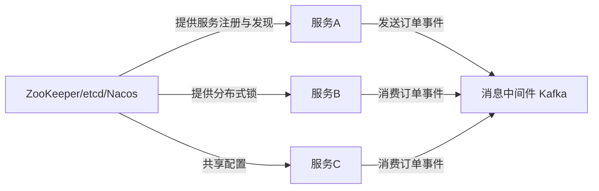

# 架构
[[toc]]

## 消息中间件

| 类型 | 产品 | 核心特点 | 典型场景 | 云厂商 |
| --- | --- | --- | --- | --- |
| 日志/流式处理型 | Apache Kafka | 高吞吐量、低延迟、分区、Exactly-once | 日志收集、事件溯源、流处理 | 阿里云 腾讯云CKafka Amazon MSK Azure Event Hubs(兼容) |
| | Redpanda | C++实现、无ZooKeeper、兼容Kafka API | 替代 Kafka（低延迟、简化运维） | |
| | Amazon Kinesis | AWS原生流服务 | 实时分析、IoT 数据管道 | |
| 企业级事务型 | Apache RocketMQ | 金融级事务消息、顺序消息、高可靠 | 订单、支付、交易系统 | 阿里云 腾讯云TDMQ 华为云DMS |
| | Apache Pulsar | 分层架构（Broker + BookKeeper） 多租户、Geo-replication | 多团队共享、跨地域复制 |
| 传统企业级 | RabbitMQ | AMQP 协议 灵活路由（Exchange/Queue） 插件丰富 | 任务队列、RPC、微服务解耦 | |
| | ActiveMQ | JMS 标准 协议多（AMQP/MQTT/OpenWire） | 传统 Java EE 系统集成 | Amazon MQ | |
| 轻量/嵌入型 | NATS/JetStream | 极简、高性能、发布订阅 | IoT、微服务内部通信 | |
| | NSQ | Go 编写、去中心化、水平扩展 | 实时消息推送、监控告警 | |
| 云原生/Serverless | Google Cloud Pub/Sub | 全托管、全球一致性、按量付费 | 事件驱动架构、跨服务通信 | |
| | Azure Service Bus | 企业集成、会话、死信队列 | 金融、ERP 系统对接 | |

新型技术
| 技术 | 定位 | 关系说明 |
| --- | --- | --- |
| Apache Flink | 流处理引擎（非消息中间件） | 通常消费 Kafka/Pulsar 数据做实时计算 |
| Pravega | 流式存储系统（由 Dell 开源） | 类似 Kafka + 分布式文件系统，支持长留存、自动分层 |
| Memphis.dev | 开发者友好的消息平台 | 兼容 NATS，提供 UI、Schema 管理、DLQ 等企业功能 |
| EMQX | MQTT 消息中间件（IoT 场景） | 专为海量设备连接设计，支持规则引擎、桥接 Kafka |
| Solace PubSub+ | 企业级事件代理 | 支持多种协议（JMS, MQTT, AMQP），用于金融、航空 |

### 建议适用场景对照表
| 需求 | 推荐中间件 |
| --- | --- |
| 高吞吐日志/事件流 | Kafka/Redpanda/Pulsar |
| 金融级事务消息 | RocketMQ |
| 微服务解耦 | RabbitMQ/NATS |
| IoT设备接入 | EMQX/Mosquitto+Kafka |
| 云原生Serverless | GCP Pub/Sub/Azure Service Bus |
| 多团队共享+跨云 | Pulsar |
| 低延迟嵌入式 | NSQ/NATS |

## 分布式协调服务
| 产品 | CAP | 数据模型 | 协议 | 生态集成 | 补充说明 |
| --- | --- | --- | --- | --- | --- |
| Zookeeper | CP | 树形ZNode | ZAB | Kafka Hadoop Dubbo | 运维复杂，主键被etcd替代 |
| etcd | CP | KV存储 | Raft | Kubernetes Prometheus | gRPC 接口，性能优于 ZK |
| Consul | AP/CP | KV + Service Catalog | Raft + Gossip | HashiCorp 生态、Nomad | 内置健康检查、ACL、Mesh |
| Nacos | AP(注册中心) CP(配置中心) | 配置中心+服务发现 | Raft/Distro | Spring Cloud Alibaba生态 | **国内主流，支持 DNS-F** |
| Eureka | AP | 服务注册表 | HTTP | Spring Cloud Netflix | 自我保护机制，已进入维护模式 |

### 建议适用场景对照表
| 需求 | 推荐服务 |
| --- | --- |
| Kubernetes 底座 | etcd |
| Spring Cloud 微服务 | Nacos/Eureka |
| 多数据中心服务发现 | Consul |
| 强一致配置管理 | etcd/ZooKeeper |

消息中间件（Message Middleware）和分布式协调服务（Distributed Coordination Service）是构建分布式系统时**两类不同但常协同工作的基础设施组件**。它们解决的问题、设计目标和使用场景有本质区别，但在实际系统中往往**紧密配合**。

下面从 **核心职责、典型交互、协作模式、常见组合** 四个维度清晰说明它们的关系：

---

## 消息中间件 VS 分布式协调服务

### 核心职责对比

| 维度 | 消息中间件 | 分布式协调服务 |
|------|-----------|----------------|
| **主要目的** | **异步通信 & 解耦** 在服务之间可靠地传递消息（事件、命令、数据） | **状态协调 & 元数据管理** 在分布式节点间达成一致、共享状态、选举主节点等 |
| **关注点** | 吞吐量、延迟、持久化、顺序性、可靠性 | 一致性（CP/AP）、可用性、选举、锁、配置同步 |
| **数据模型** | 消息队列 / 主题（Queue/Topic） 生产者 → 中间件 → 消费者 | 键值对（KV）或树形结构（ZNode） 所有节点读写同一份“协调状态” |
| **典型操作** | send(), publish(), consume(), ack() | create(), get(), watch(), lock(), leader election |

> ✅ 简单说：
> - **消息中间件 = “传话的邮差”**（负责传递业务数据）
> - **协调服务 = “开会的主持人”**（负责统一大家的行为规则）

---

## 二、典型交互关系（谁依赖谁？）

### ✅ 协调服务 **支撑** 消息中间件的高可用架构

很多消息中间件**内部依赖协调服务**来实现集群管理：

| 消息中间件 | 依赖的协调服务 | 用途 |
|----------|--------------|------|
| **Kafka** | ZooKeeper（旧版） **KRaft（新版本去 ZK）** | Broker 注册、Leader 选举、Partition 状态管理 |
| **RocketMQ** | **自研（基于 DLedger/Raft）** （早期 NameServer 无协调，现支持 CP 模式） | Master 选举、配置同步 |
| **Pulsar** | **ZooKeeper + BookKeeper** | Broker 注册、Ledger 元数据管理 |
| **RabbitMQ** | **无外部依赖**（通过 Erlang 集群协议） | 节点发现、镜像队列同步 |

> 🔍 结论：**协调服务是消息中间件“背后的大脑”**，用于维护集群元数据一致性。

---

### ✅ 消息中间件 **消费** 协调服务的事件（较少见）

某些高级场景下，协调服务的状态变更会**触发消息通知**：

- Consul 支持 **Watch 机制**，当服务注册/健康状态变化时，可触发 HTTP 回调或脚本，进而**发送消息到 Kafka/RabbitMQ**。
- Nacos 的配置变更可通过 **Listener** 推送事件到消息队列，实现“配置驱动业务”。

> ⚠️ 这属于**应用层集成**，非底层依赖。

---

## 三、协作模式（在业务系统中如何共存？）

在一个典型的微服务系统中，两者分工明确：

- **消息中间件**：处理 **业务数据流**（如“用户下单”、“支付成功”）
- **协调服务**：处理 **系统控制面**（如“哪个实例是主节点？”、“配置是否更新？”、“服务是否在线？”）

> ✅ 它们分别作用于系统的 **数据平面（Data Plane）** 和 **控制平面（Control Plane）**

---

## 四、常见组合实践

| 场景 | 消息中间件 | 协调服务 | 说明 |
|------|-----------|---------|------|
| 大数据日志管道 | Kafka | ZooKeeper（或 KRaft） | Kafka 依赖 ZK 管理元数据 |
| 金融交易系统 | RocketMQ | 自带 DLedger（Raft） | RocketMQ 内置协调，无需外置 ZK |
| 云原生微服务 | RabbitMQ / NATS | etcd / Nacos | 服务发现用 Nacos，异步解耦用 MQ |
| Kubernetes 生态 | —— | **etcd** | K8s 本身重度依赖 etcd，应用可选配 Kafka/Pulsar |
| 多云混合架构 | Pulsar | ZooKeeper | Pulsar 利用 ZK 实现跨地域复制协调 |

---

## ✅ 总结：关系一句话概括

> **分布式协调服务为消息中间件提供“集群大脑”（元数据一致性），而消息中间件为业务系统提供“通信神经”（异步数据流）。二者在架构上正交，在实践中互补。**

它们不是替代关系，而是**分层协作**：
- 协调服务 → **保障系统自身稳定运行**
- 消息中间件 → **保障业务数据可靠流转**

在设计分布式系统时，通常**先选协调服务（如 etcd/Nacos）搭建控制面，再选消息中间件（如 Kafka/RocketMQ）搭建数据面**。

## [Zookeeper](./zookeeper/index.md)
<!-- @include:./zookeeper/zookeeper_intro.md -->