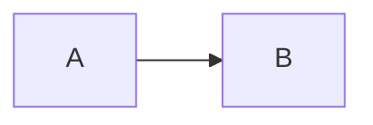

# VuePress 常用插件
[[toc]]
::: tip
[VuePress 市场](https://marketplace.vuejs.press/zh/)和[VuePress 生态系统](https://ecosystem.vuejs.press/zh/)提供了很多常用的插件，本文介绍了这些常用插件的安装和使用方法。
- Markdown 相关
   <!-- @include:./common_markdown.md -->
:::

## Markdown 相关
### Markdown 语法扩展
#### 选项卡和代码选项卡 @vuepress/plugin-markdown-tab
安装依赖：
```bash
npm i -D @vuepress/plugin-markdown-tab@next
```

在 `.vuepress/config.js` 文件中，添加以下内容，启用功能：
```javascript
import { markdownTabPlugin } from '@vuepress/plugin-markdown-tab'

export default {
    plugins: [
        markdownTabPlugin({
            // 启用代码选项卡
            codeTabs: true,
            // 启用选项卡
            tabs: true,
        }),
    ],
}
```

在 Markdown 文件中，使用如下语法：
````markdown
::: code-tabs#shell

@tab pnpm

```bash
pnpm add -D vuepress
```

@tab yarn

```bash
yarn add -D vuepress
```

@tab:active npm

```bash
npm i -D vuepress
```

:::
````

#### 导入文件
@vuepress/plugin-markdown-include 是一个可以导入其他 Markdown 文件的插件，被包含的文件会完整渲染，包括 Frontmatter、Markdown 语法、Vue 组件等，支持嵌套包含。
::: tip
和官方自带的markdown-it-import-code插件有何不同？
- markdown-it-import-code 插件主要用于嵌入代码文件的特定部分，常见于展示代码片段。
- @vuepress/plugin-markdown-include 插件用于嵌入完整的 Markdown 文件内容，适合用于文档模块化。

|特性|markdown-it-import-code|@vuepress/plugin-markdown-include|
| --- | --- | --- |
| 目标内容 |完整Markdown文件  |代码文件 |
| 渲染方式 | 渲染为 Markdown/Vue 组件 | 渲染为代码块（语法高亮）|
| 插件类型 | VuePress 官方插件 | markdown-it 通用插件 |
| 语法 | `<!-- @include: ./file.md -->` |`@[code](file.js)` |
:::

安装依赖：
```bash
npm i -D @vuepress/plugin-markdown-include@next
```

在 `.vuepress/config.js` 文件中，添加以下内容，启用功能：
```javascript
import { markdownIncludePlugin } from '@vuepress/plugin-markdown-include'

export default {
    plugins: [
        markdownIncludePlugin({
            // 选项
        }),
    ],
}
```

在 Markdown 文件中，使用如下语法：
````markdown
<!-- @include: ./common_summary.md -->
````

### 功能集成
#### Markdown增强
为 VuePress2 提供更多 [Markdown增强](https://plugin-md-enhance.vuejs.press/zh/)功能。包括：
  - 图表：Chart.js、ECharts、Markmap、Mermaid、Plantuml、流程图等
  - 代码：提供了Kotlin、Sandpack、Vue等交互演示支持
注：Plantuml配置无效，待解决。目前可使用Mermaid语法。

安装依赖：
安装vuepress-plugin-md-enhance插件，根据需要安装其他依赖。
```bash
npm i -D vuepress-plugin-md-enhance@2.0.0-rc.88
npm i -D chart.js
npm i -D echarts
npm i -D markmap-lib markmap-toolbar markmap-view
npm i -D mermaid
npm i -D flowchart.ts
```

注：
1. 若安装插件时提示`npm error peer vuepress@"2.0.0-rc.23" from vuepress-plugin-md-enhance@2.0.0-rc.88
   `，可添加`--legacy-peer-deps`参数强制安装，但不推荐(执行npm install时会报警告)。
2. RC 版本（即 Release Candidate，发布候选版）是正式版（Stable）发布前的测试版本，生产环境建议使用 latest 稳定版。VuePress 2.x 目前仍处于 Beta/RC 阶段（如 2.0.0-rc.23），若需稳定版本，只能使用 1.x 的 v1.9.10。因为涉及API的变动，还是选择使用2.x的最新版本，手动解决依赖问题。
4. `vuepress-plugin-md-enhance`当前最新版本为 `^2.0.0-rc.88`，与之兼容的版本如下：
```json
"devDependencies": {
    "@vuepress/bundler-vite": "2.0.0-rc.23",
    "@vuepress/plugin-blog": "^2.0.0-rc.104",
    "@vuepress/theme-default": "2.0.0-rc.104",
    "vuepress": "^2.0.0-rc.23",
    "vuepress-plugin-md-enhance": "^2.0.0-rc.88"
  }
```

启用插件：
在 `.vuepress/config.js` 文件中，添加以下内容，启用功能：
```javascript
import { mdEnhancePlugin } from "vuepress-plugin-md-enhance";

export default {
    plugins: [
        mdEnhancePlugin({ 
            chartjs: true, 
            echarts: true,
            flowchart: true,
            markmap: true,
            mermaid: true,
            plantuml: true,            
        }),
    ],
};
```

1. 在 Markdown 文件中使用Mermaid语法：


## 侧边栏插件
### ~~vuepress-plugin-anchor-right~~
此插件不再维护，建议使用主题，主题是基于官方的，除了加个导航，没有任何多余代码！
安装：
```bash
npm install -d vuepress-plugin-anchor-right
```
### ~~vuepress-plugin-right-anchor~~
报错`Failed to resolve import "ts-debounce" from "node_modules/vuepress-plugin-right-anchor/lib/client/components/RightAnchor.js?v=1ee1cae6". Does the file exist?`
安装：
```bash
npm i vuepress-plugin-right-anchor@next -D
```

### ~~vuepress-plugin-right-anchor-plus~~
安装依赖失败，怀疑是deepSeek虚构的插件。

### ~~vuepress-plugin-side-anchor~~
配置无效，猜测是vuepress版本问题(`module.exports`是vuepress1.x的写法)，暂时不使用。
安装：
```bash
npm i vuepress-plugin-side-anchor -D
```
在`.vuepress/config.js `中添加以下配置：
```js
module.exports = {
    plugins: [
        ['vuepress-plugin-right-anchor']
    ]
}
```
### vuepress-plugin-auto-sidebar???
安装：
```bash
npm i vuepress-plugin-auto-sidebar@alpha -D
```

<!-- @include: ./common_summary.md -->