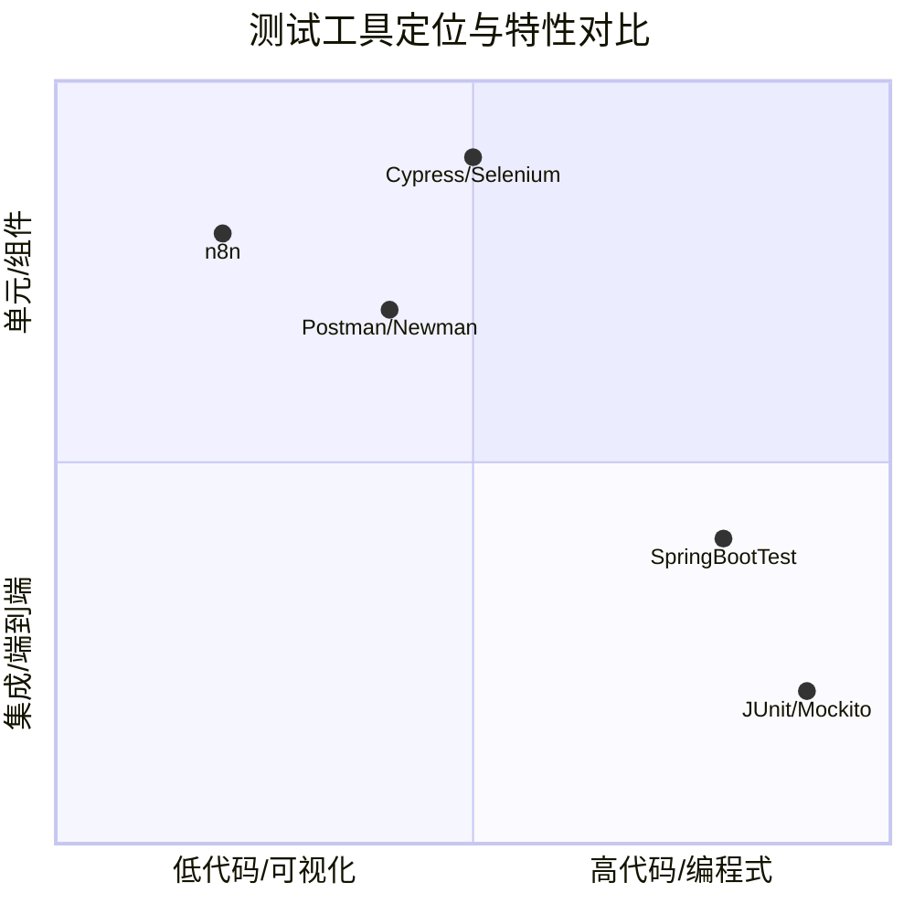

# n8n在Spring Boot开发测试中的应用与对比分析

> 探索n8n如何作为工作流自动化工具增强Spring Boot开发测试，并与传统测试框架进行全面对比

## 📋 目录导航

- [核心价值：API工作流自动化](#-核心价值api工作流自动化)
- [测试相关应用](#-测试相关应用)
- [开发环境应用](#-开发环境应用)
- [具体配置示例](#-具体配置示例)
- [与Spring Boot生态集成](#-与spring-boot生态集成)
- [部署方式](#-部署方式)
- [实际使用建议](#-实际使用建议)
- [最佳实践](#-最佳实践)
- [n8n与传统测试框架的对比分析](#-n8n与传统测试框架的对比分析)
- [各框架的典型测试场景](#-各框架的典型测试场景)
- [实际工作流中的协作](#-实际工作流中的协作)
- [选择建议](#-选择建议)
- [总结](#-总结)

n8n在Spring Boot开发测试中可以成为一个强大的**工作流自动化和集成工具**，帮助提升开发效率和测试质量。

## 🔄 核心价值：API工作流自动化

n8n的核心优势在于可视化地编排API调用和工作流，这在Spring Boot开发中特别有用。

## 🧪 测试相关应用

### 1. 集成测试自动化
```yaml
# 使用n8n创建复杂的API测试流程
HTTP Request → 数据验证 → 数据库检查 → 报告生成
```

**典型测试场景**：
- **多接口串联测试**：用户注册 → 登录 → 业务操作 → 结果验证
- **数据一致性测试**：API响应 vs 数据库数据 vs 缓存数据
- **第三方服务模拟**：在测试环境中模拟支付、短信等外部API

### 2. 性能测试辅助
```javascript
// n8n工作流示例：简单的负载测试
// 1. 循环节点：并发请求模拟
// 2. HTTP节点：调用Spring Boot接口
// 3. 延迟节点：控制请求频率
// 4. 日志节点：记录响应时间
```

### 3. 测试数据管理
```python
# 自动化测试数据准备和清理
工作流步骤：
1. 清理测试数据 (DELETE /api/test/cleanup)
2. 生成测试数据 (POST /api/test/fixtures)
3. 验证数据状态 (GET /api/test/status)
4. 执行测试用例
```

### 4. AI辅助测试与分析
```javascript
// 使用n8n的AI节点进行智能测试数据分析
// 1. 收集测试执行结果
// 2. AI节点分析失败模式
// 3. 自动归类缺陷并提供修复建议
// 4. 生成智能测试报告
```

**AI测试优势**：
- 自动化测试数据分析，快速识别异常模式
- 智能生成测试用例和测试数据
- 自动识别潜在API问题和安全漏洞
- 测试报告的自然语言总结，提高可读性

## 🔧 开发环境应用

### 1. Mock服务搭建（postman也可实现）
```javascript
// 使用n8n快速创建Mock API
// HTTP节点配置：
// - 路径: /api/mock/users/{id}
// - 方法: GET
// - 响应: JSON模板 + 动态数据
```

**优势**：
- 前端开发不阻塞后端API进度
- 支持复杂的响应逻辑和错误场景
- 可视化配置，无需编码

### ~~2. 数据迁移和转换~~
```yaml
# 数据库迁移工作流
旧数据库查询 → 数据转换 → 新数据库插入 → 结果验证
```

### 3. 实时监控和告警（定时任务+企微也可实现）
```javascript
// 应用监控工作流
// 1. 定时调用健康检查: GET /actuator/health
// 2. 检查响应状态和指标
// 3. 异常时发送通知: Slack/邮件/钉钉
// 4. 记录监控日志
```

## 📊 具体配置示例

### n8n中的Spring Boot测试工作流
```json
{
  "workflow": {
    "nodes": [
      {
        "name": "创建测试用户",
        "type": "n8n-nodes-base.httpRequest",
        "parameters": {
          "method": "POST",
          "url": "http://localhost:8080/api/users",
          "body": {
            "name": "测试用户{{ $now }}",
            "email": "test{{ $now }}@example.com"
          }
        }
      },
      {
        "name": "验证用户创建",
        "type": "n8n-nodes-base.httpRequest", 
        "parameters": {
          "method": "GET",
          "url": "http://localhost:8080/api/users/{{ $json.id }}"
        }
      },
      {
        "name": "数据库验证",
        "type": "n8n-nodes-base.postgres",
        "parameters": {
          "query": "SELECT * FROM users WHERE id = {{ $json.id }}"
        }
      }
    ]
  }
}
```

## 🚀 与Spring Boot生态集成

### 1. 与Spring Actuator结合
```yaml
# 监控工作流
- 定时获取 /actuator/metrics
- 分析应用指标
- 阈值告警
- 自动扩容决策
```

### 2. 与Spring Cloud集成
```yaml
# 微服务测试流程
1. 调用服务A → 2. 验证服务B状态 → 3. 检查配置中心 → 4. 网关路由测试
```

### 3. 与Testcontainers配合
```javascript
// 集成测试工作流
// 1. 启动Testcontainers
// 2. 执行测试套件  
// 3. 收集测试结果
// 4. 生成测试报告
```

## 🛠 部署方式

### 开发环境：
```bash
# Docker快速启动
docker run -it --rm \
  --name n8n \
  -p 5678:5678 \
  -v ~/.n8n:/home/node/.n8n \
  n8nio/n8n
```

### 集成到CI/CD：
```yaml
# GitHub Actions示例
- name: 运行n8n测试工作流
  run: |
    curl -X POST http://n8n-server:5678/webhook/springboot-test
```

## 💡 实际使用建议

### 适合使用n8n的场景：
✅ **快速原型验证** - 测试新API接口的多种调用组合  
✅ **数据管道测试** - 验证复杂的数据流转逻辑  
✅ **第三方集成测试** - 模拟外部服务交互  
✅ **监控和告警** - 创建自定义的应用监控  
✅ **测试数据管理** - 自动化测试环境准备  

### 不适合的场景：
❌ **单元测试** - 使用JUnit/Mockito更合适  
❌ **性能基准测试** - 使用JMeter/Gatling更专业  
❌ **代码级集成测试** - 使用SpringBootTest更直接  

## 📈 最佳实践

1. **版本控制工作流** - 将n8n工作流导出为JSON并纳入Git管理
2. **环境隔离** - 为开发/测试/生产配置不同的n8n实例
3. **错误处理** - 在工作流中配置完善的异常处理和重试机制
4. **监控n8n自身** - 确保n8n服务的可用性和性能
5. **AI节点最佳实践**
   - 使用环境变量存储AI API密钥，避免硬编码
   - 为AI提示词创建模板，提高一致性
   - 实现速率限制处理，避免API调用超限
   - 缓存AI响应结果，减少重复调用
6. **与现代工具链集成**
   - 与Playwright结合进行端到端测试自动化
   - 集成OpenTelemetry进行分布式追踪分析
   - 使用容器编排工具管理n8n实例和依赖服务

n8n在Spring Boot开发测试中主要扮演"**集成胶水**"和"**自动化助手**"的角色，特别适合处理那些需要多个系统协作、需要可视化编排的测试和开发任务。


## 📊 n8n与传统测试框架的对比分析

选择正确的测试工具能极大提升开发效率。为了直观理解，我们先来看一张对比图，它清晰地展示了不同工具在测试金字塔中的定位和特性：



### 📊 详细对比分析表

| 维度 | n8n | Postman/Newman | SpringBootTest + JUnit | Cypress/Selenium | JMeter/Gatling | Hoppscotch/Insomnia |
|------|-----|----------------|------------------------|------------------|----------------|---------------------|
| **核心定位** | 工作流自动化与集成平台 | API测试与协作 | 应用程序单元/集成测试 | 端到端UI测试 | 负载与性能测试 | 轻量级API测试工具 |
| **测试类型** | **集成测试**、**API编排**、**数据管道测试**、**AI辅助测试** | **API测试**、**契约测试** | **单元测试**、**集成测试**、**切片测试** | **UI测试**、**端到端测试** | **压力测试**、**负载测试**、**性能测试** | **快速API原型测试**、**开发者测试** |
| **学习曲线** | 🟢 平缓 (低代码) | 🟢 平缓 (图形界面) | 🔴 陡峭 (需要Java/Spring知识) | 🟡 中等 (需要JavaScript/CSS选择器) | 🟡 中等 (图形界面+配置) | 🟢 极平缓 (简洁界面) |
| **编程要求** | 低代码/无代码 | 低代码 (脚本增强) | 高代码 (Java) | 中代码 (JavaScript) | 中代码 (配置+脚本) | 几乎无代码 |
| **集成能力** | 🟢 **极强** (600+连接器 + AI集成) | 🟢 强 (主要HTTP API) | 🟢 强 (Spring生态原生) | 🟡 中等 (浏览器自动化) | 🟡 中等 (主要HTTP协议) | 🟡 中等 (基本API功能) |
| **执行环境** | n8n服务器 (独立) | CLI/Cloud/Desktop | JVM (与应用同进程) | 浏览器/Node.js | JVM (独立进程) | 浏览器/桌面应用 |
| **反馈速度** | 🟡 中等 (网络调用) | 🟢 快速 | 🟢 **极快** (内存中测试) | 🔴 慢 (启动浏览器) | 🟡 中等 (取决于测试规模) | 🟢 极快 (轻量级) |
| **维护成本** | 🟢 低 (可视化) | 🟢 低 | 🔴 高 (代码维护) | 🟡 中等 (选择器脆弱) | 🟡 中等 (测试计划维护) | 🟢 极低 |
| **CI/CD集成** | 🟢 良好 (Webhook/CLI) | 🟢 优秀 (Newman) | 🟢 **极佳** (Maven/Gradle原生) | 🟢 良好 (Docker化) | 🟢 良好 (CLI模式) | 🟡 一般 (有限的CI集成) |
| **数据驱动测试** | 🟢 **极强** (内置数据处理 + AI生成) | 🟢 强 (CSV/JSON数据) | 🟢 强 (参数化测试) | 🟡 中等 | 🟢 强 (外部数据源) | 🟡 有限 |
| **AI功能** | 🟢 **强大** (原生AI集成) | 🟡 基础 (部分AI辅助) | 🟡 有限 (需第三方库) | 🟡 有限 (需插件) | 🟡 有限 | 🔴 较弱 |

---

## 🎯 各框架的典型测试场景

### n8n 的甜点区
```yaml
# 复杂业务流程验证
场景: "用户注册到订单完成的全流程"
步骤:
  1. 调用A服务: 创建用户
  2. 调用B服务: 用户登录
  3. 调用C服务: 浏览商品
  4. 调用D服务: 创建订单
  5. 调用E服务: 模拟支付
  6. 验证: 数据库订单状态 + 消息队列事件
```

### Postman 更适合
```javascript
// API契约测试
pm.test("创建用户响应结构正确", function() {
    pm.expect(pm.response.json()).to.have.property('id');
    pm.expect(pm.response.json()).to.have.property('email');
});

// API工作流测试
pm.setNextRequest("登录测试"); // 控制执行顺序
```

### SpringBootTest 的核心优势
```java
// 快速反馈的组件测试
@WebMvcTest(UserController.class)
class UserControllerTest {
    
    @MockBean
    private UserService userService;
    
    @Test
    void shouldCreateUser() {
        // 给定
        given(userService.create(any())).willReturn(new User(1L, "test"));
        
        // 当
        mockMvc.perform(post("/api/users")
                .contentType(APPLICATION_JSON)
                .content("{\"name\":\"test\"}"))
                
        // 那么
        .andExpect(status().isOk())
        .andExpect(jsonPath("$.id").value(1));
    }
}
```

### JMeter 的专业领域
```java
// 负载测试配置
Thread Group: 100并发用户, 循环100次
└── HTTP Request: POST /api/users
    ├── JSON Extractor: 提取userId  
    └── Response Assertion: 验证响应时间 < 200ms
```

---

## 🔄 实际工作流中的协作

### 理想的测试策略组合
```yaml
开发阶段:
  - 单元测试: JUnit + Mockito (快速反馈)
  - 集成测试: SpringBootTest (组件集成)
  
测试阶段:  
  - API测试: Postman Collections (API契约)
  - 业务流程: n8n工作流 (跨服务验证)
  - 性能测试: JMeter (负载能力)
  - UI测试: Cypress (用户交互)

生产阶段:
  - 监控告警: n8n (实时监控工作流)
  - 定期巡检: n8n + Postman (健康检查)
```

### 具体协作示例：用户注册功能测试

```java
// 1. JUnit (单元测试)
@Test
void shouldEncodePassword() {
    // 测试密码编码器
}

// 2. SpringBootTest (集成测试)  
@Test
void shouldSaveUserToDatabase() {
    // 测试UserService与数据库交互
}

// 3. Postman (API测试)
// 测试 /api/register 端点返回正确状态码

// 4. n8n (业务流程测试)
// 注册 → 验证邮件 → 登录 → 权限检查 完整流程

// 5. JMeter (性能测试)
// 100用户并发注册性能
```

---

## 💡 选择建议

### 选择 n8n 当：
✅ 测试涉及**多个异构系统** (数据库 + API + 消息队列 + 文件系统)  
✅ 需要复杂的**数据准备和清理**  
✅ 测试**业务流程**而非单个功能点  
✅ 团队**测试编码能力较弱**但业务理解强  
✅ 需要将测试能力**暴露给非技术成员**  

### 选择 传统测试框架 当：
✅ 测试**单个Spring Boot应用**的内部逻辑  
✅ 需要**快速反馈**的开发期测试  
✅ 测试与**Spring上下文**紧密集成  
✅ 团队有较强的**编程能力**  
✅ 测试需要**深度Mock和定制**

### 现实中的混合策略
```bash
# CI/CD管道中的协同
1. 代码提交 → 触发构建
2. 运行JUnit/SpringBootTest (快速失败)
3. 部署到测试环境
4. 运行Postman集合 (API验证)
5. 触发n8n业务流程测试 (端到端验证) 
6. 定时运行JMeter测试 (性能基准)
7. n8n监控生产环境API健康度
```

## 🎯 总结

n8n不是要**取代**传统测试框架，而是要**补充**它们。它填补了"复杂业务流程自动化测试"和"多系统集成测试"的空白，让团队能够以更低的成本验证真实的业务场景。

### 🚀 未来趋势展望

随着低代码/无代码测试平台的兴起，n8n在Spring Boot测试领域的价值将进一步凸显：<mcreference link="http://m.toutiao.com/group/7452633642527949362/" index="2">2</mcreference>

1. **AI驱动的测试自动化** - n8n的AI集成将使测试用例生成、数据分析和报告生成更加智能化
2. **测试左移与右移的桥梁** - 在开发早期和生产监控之间建立无缝连接
3. **跨团队协作增强** - 帮助开发、测试和运维团队更好地协同工作
4. **测试资产的可视化管理** - 通过工作流可视化提升测试资产的可维护性

在Spring Boot开发中，理想的测试策略是让**正确的工具做它最擅长的事**，形成一个覆盖全面、效率优化的测试体系。随着n8n持续发展，它将在这个体系中扮演越来越重要的角色，特别是在集成测试、工作流自动化和AI辅助测试方面。