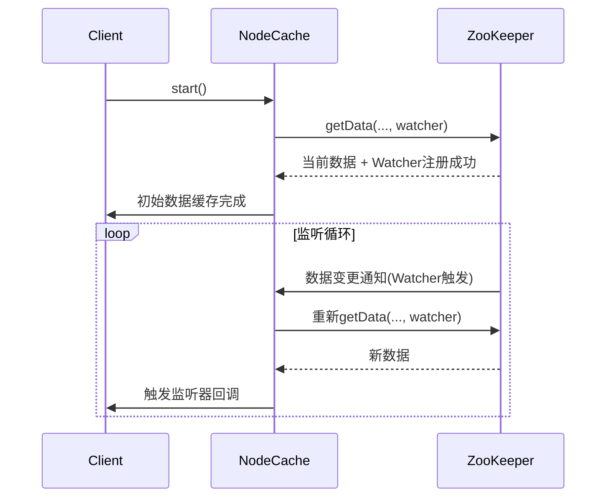

# Zookeeper客户端——Curator
[[toc]]

## 添加依赖

```xml
<!-- https://mvnrepository.com/artifact/org.apache.curator/apache-curator -->
<dependency>
    <groupId>org.apache.curator</groupId>
    <artifactId>curator-framework</artifactId>
    <version>2.4.2</version>
</dependency>

<dependency>
  <groupId>org.apache.curator</groupId>
  <artifactId>curator-recipes</artifactId>
  <version>2.4.2</version>
</dependency>
```

## 基础应用

### 创建会话

Curator除了使用一般方法创建会话外，还可以使用fluent风格进行创建。

::: tip
Fluent 风格（Fluent Interface）是一种面向对象的API设计风格，旨在通过方法链（Method Chaining）使代码更易读、更接近自然语言。
方法链即连续调用方法（每个方法返回对象本身或新对象）。
:::

```java
package com.hust.grid.leesf.curator.examples;

import org.apache.curator.RetryPolicy;
import org.apache.curator.framework.CuratorFramework;
import org.apache.curator.framework.CuratorFrameworkFactory;
import org.apache.curator.retry.ExponentialBackoffRetry;

public class CuratorExample {
    public static void main(String[] args) throws Exception {
        RetryPolicy retryPolicy = new ExponentialBackoffRetry(1000, 3);
        
        CuratorFramework client = CuratorFrameworkFactory.newClient("127.0.0.1:2181", 5000, 3000, retryPolicy);
        client.start();
        System.out.println("Zookeeper session1 established. ");
        
        CuratorFramework client1 = CuratorFrameworkFactory.builder()
                .connectString("127.0.0.1:2181")
                .sessionTimeoutMs(5000)
                .retryPolicy(retryPolicy)
                .namespace("base").build();
        client1.start();
        System.out.println("Zookeeper session2 established. ");        
    }
}
```

### 创建节点

```java
client.create()
        .creatingParentsIfNeeded()
        .withMode(CreateMode.EPHEMERAL)
        .forPath(path, "init".getBytes());
```

### 删除节点

```java
client.delete().deletingChildrenIfNeeded().withVersion(stat.getVersion()).forPath(path);
```

### 获取节点数据

```java
Stat stat = new Stat();
System.out.println(new String(client.getData().storingStatIn(stat).forPath(path)));
```

### 更新数据

```java
Stat stat = new Stat();
client.getData().storingStatIn(stat).forPath(path);
try {
    client.setData().withVersion(stat.getVersion()).forPath(path);
} catch (Exception e) {
    System.out.println("Fail set node due to " + e.getMessage());
}
```

注意：
- 当携带数据版本不一致时，无法完成更新操作。

### 异步接口

```java
client.create().creatingParentsIfNeeded().withMode(CreateMode.EPHEMERAL).inBackground(new BackgroundCallback() {
  public void processResult(CuratorFramework client, CuratorEvent event) throws Exception {
      System.out.println("event[code: " + event.getResultCode() + ", type: " + event.getType() + "]" 
            + ", Thread of processResult: " + Thread.currentThread().getName());
      System.out.println();
      semaphore.countDown();
  }
}, tp).forPath(path, "init".getBytes());
```

## 服务注册与发现
::: code-tabs
@tab 服务注册
@[code](../../code/zookeeper/ServiceRegisterExample.java)

@tab 服务发现
@[code](../../code/zookeeper/ServiceDiscoveryExample.java)
:::

::: tip
服务注册与发现没放到应用场景中，因为Curator使用基础API即可实现该功能，无需额外的依赖。
:::

## 应用场景（curator-recipes）

### 节点监听
NodeCache 是 Apache Curator 提供的一个实用工具类，可以自动处理 Watcher 的重新注册，实现对 ZNode 数据变化的持续监听。它封装了 ZooKeeper 原生 Watcher 的复杂性，提供了更友好的事件驱动编程模型。

核心特性：
- 自动处理 Watcher 重新注册：每次触发事件后自动重新注册 Watcher，无需手动处理 Watcher 失效问题
- 本地缓存：在内存中维护节点数据的缓存副本，提供`getCurrentData()`快速访问最新数据
- 事件通知：通过监听器模式通知数据变化，保证事件顺序性

内部工作机制：


使用方式：
::: code-tabs
@tab 基础方法
@[code](../../code/zookeeper/NodeCacheExample.java)

@tab 初始数据加载控制
```java
// 不强制初始加载（快速启动，异步获取数据）
cache.start(false);

// 强制同步初始加载（阻塞直到获取到初始数据）
cache.start(true);
```

@tab 监听节点创建/删除
```java
NodeCache cache = new NodeCache(client, "/path", false); // 第三个参数表示不缓存数据

cache.getListenable().addListener(() -> {
    if (cache.getCurrentData() != null) {
        System.out.println("节点创建或更新");
    } else {
        System.out.println("节点被删除");
    }
});
```

@tab 同时监听父节点数据和子节点变化
```java
// 结合PathChildrenCache监听子节点
PathChildrenCache childrenCache = new PathChildrenCache(client, "/parent", true);
NodeCache nodeCache = new NodeCache(client, "/parent");

// 同时监听父节点数据和子节点变化
Executors.newSingleThreadExecutor().submit(() -> {
    childrenCache.getListenable().addListener(...);
    nodeCache.getListenable().addListener(...);
    childrenCache.start();
    nodeCache.start();
});
```
:::

#### 节点缓存应用场景
##### 配置中心
```java
NodeCache configCache = new NodeCache(client, "/configs/app1");
  configCache.getListenable().addListener(() -> {
  reloadConfig(cache.getCurrentData().getData());
  });
```

##### 特性开关
```java
NodeCache featureCache = new NodeCache(client, "/features/new-ui");
featureCache.getListenable().addListener(() -> {
    enableNewUI = cache.getCurrentData() != null;
});
```

##### 分布式锁辅助
@[code](../../code/zookeeper/DistributedLockExample.java)


分布式锁辅助与Curator标准锁的对比：
- InterProcessMutex 排他锁，阻塞式获取锁；联锁，同时获取多个资源的锁，避免死锁
- InterProcessReadWriteLock 读写锁
- InterProcessSemaphoreV2 信号量
- 分布式锁辅助提供非阻塞+事件通知能力

适合场景：
- 锁竞争不激烈的中低频场景
- 需要快速响应锁释放事件
- 业务容忍短暂的多客户端并发（重试期间）
- 非严格公平的场景
  

### 子节点监听

@[code](../../code/zookeeper/PathChildrenCacheExample.java)

### Master选举

@[code](../../code/zookeeper/LeaderSelectorExample.java)

### 分布式锁
- 排他锁：同一时间只允许一个客户端访问资源
- 共享锁：多个客户端可同时读取，但写入时独占

::: code-tabs 
@tab 排他锁
@[code](../../code/zookeeper/InterProcessMutexExample.java)
:::

### 分布式队列

分布式队列的典型应用场景是消息队列，借助Zookeeper可以很方便实现分布式队列功能：指定一个Zookeeper临时节点作为队列，多个应用实例在分布式锁的控制下，通过创建临时顺序节点来实现队列功能。

```java
DistributedQueue queue = new DistributedQueue(client, "/queue");

// 生产消息
queue.offer("message1".getBytes());

// 消费消息
byte[] message = queue.take();
```

### 分布式计数器

分布式计数器的典型应用是统计系统的在线人数，借助Zookeeper也可以很方便实现分布式计数器功能：指定一个Zookeeper数据节点作为计数器，多个应用实例在分布式锁的控制下，通过更新节点的内容来实现计数功能。
<!--@[code](../../code/zookeeper/DistributedCounterExample.java)-->

### 分布式Barrier

<!--@[code](../../code/zookeeper/DistributedBarrierExample.java)-->

## Curator工具类

### ZKPaths

其提供了简单的API来构建znode路径、递归创建、删除节点等。

```java
package com.zmy.curator.examples;

import org.apache.curator.framework.CuratorFramework;
import org.apache.curator.framework.CuratorFrameworkFactory;
import org.apache.curator.retry.ExponentialBackoffRetry;
import org.apache.curator.utils.ZKPaths;
import org.apache.curator.utils.ZKPaths.PathAndNode;
import org.apache.zookeeper.ZooKeeper;

public class ZKPathsExample {
    static String path = "/curator_zkpath";
    static CuratorFramework client = CuratorFrameworkFactory.builder()
            .connectString("127.0.0.1:2181")
            .sessionTimeoutMs(5000)
            .retryPolicy(new ExponentialBackoffRetry(1000, 3))
            .build();

    public static void main(String[] args) throws Exception {
        client.start();
        ZooKeeper zookeeper = client.getZookeeperClient().getZooKeeper();

        System.out.println(ZKPaths.fixForNamespace(path, "sub"));
        System.out.println(ZKPaths.makePath(path, "sub"));
        System.out.println(ZKPaths.getNodeFromPath("/curator_zkpath_sample/sub1"));

        PathAndNode pn = ZKPaths.getPathAndNode("/curator_zkpath_sample/sub1");
        System.out.println(pn.getPath());
        System.out.println(pn.getNode());

        String dir1 = path + "/child1";
        String dir2 = path + "/child2";
        ZKPaths.mkdirs(zookeeper, dir1);
        ZKPaths.mkdirs(zookeeper, dir2);
        System.out.println(ZKPaths.getSortedChildren(zookeeper, path));

        ZKPaths.deleteChildren(client.getZookeeperClient().getZooKeeper(), path, true);
    }
}
```

### EnsurePath

```java
package com.zmy.curator.examples;

import org.apache.curator.framework.CuratorFramework;
import org.apache.curator.framework.CuratorFrameworkFactory;
import org.apache.curator.retry.ExponentialBackoffRetry;
import org.apache.curator.utils.EnsurePath;

public class EnsurePathExample {
    static String path = "/zk-book/c1";
    static CuratorFramework client = CuratorFrameworkFactory.builder()
            .connectString("127.0.0.1:2181")
            .sessionTimeoutMs(5000)
            .retryPolicy(new ExponentialBackoffRetry(1000, 3))
            .build();

    public static void main(String[] args) {
        client.start();
        client.usingNamespace("zk-book");

        EnsurePath ensurePath = new EnsurePath(path);
        ensurePath.ensure(client.getZookeeperClient());
        ensurePath.ensure(client.getZookeeperClient());

        EnsurePath ensurePath2 = client.newNamespaceAwareEnsurePath("/c1");
        ensurePath2.ensure(client.getZookeeperClient());
    }
}
```