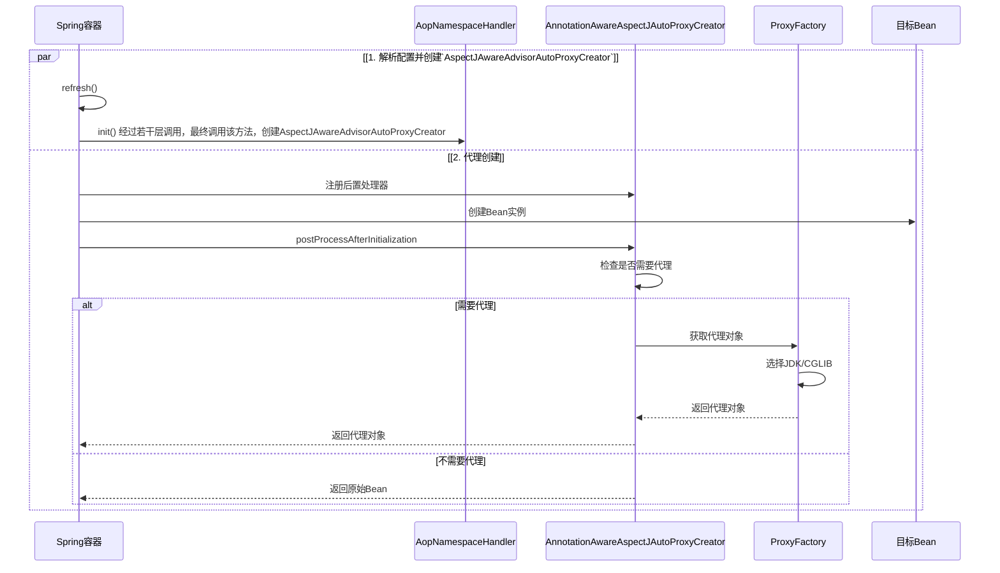
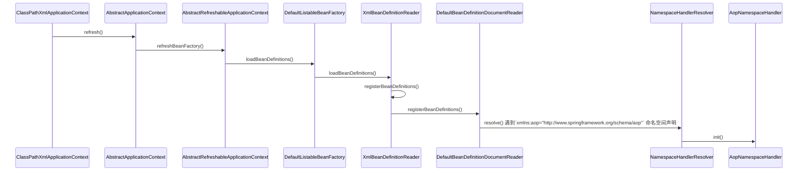
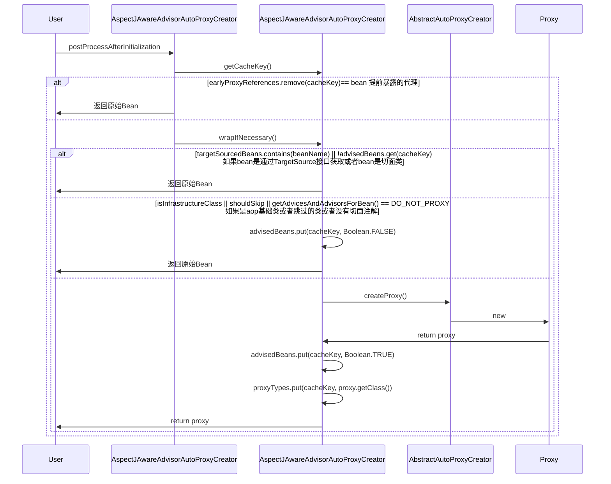
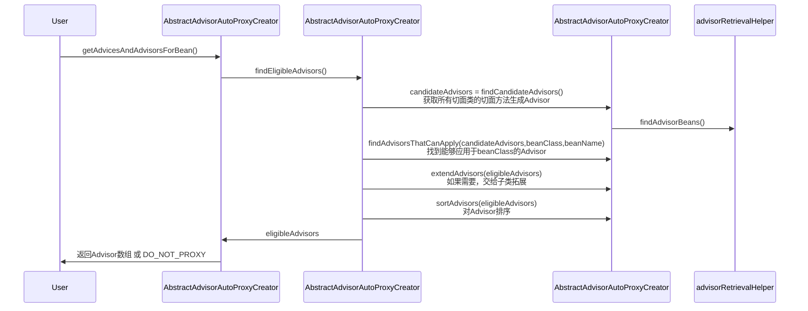
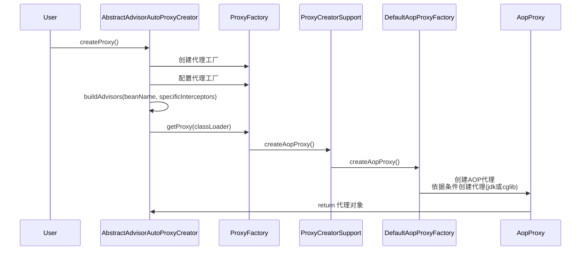
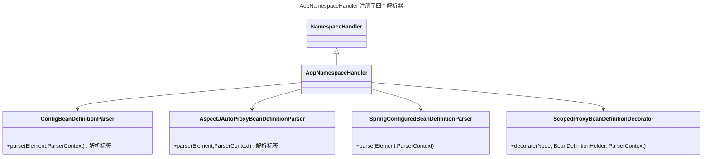
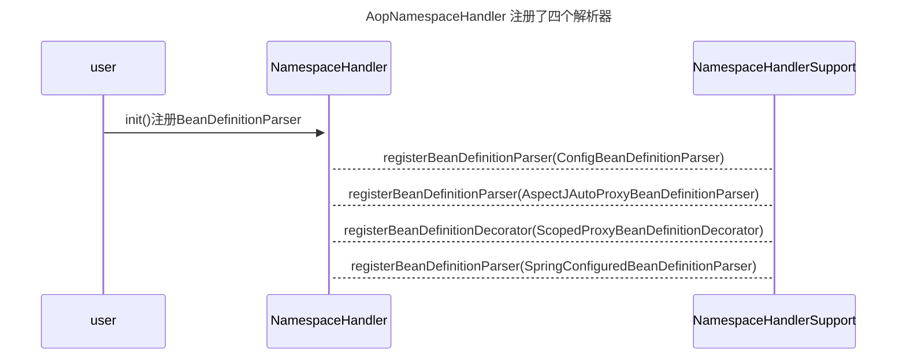
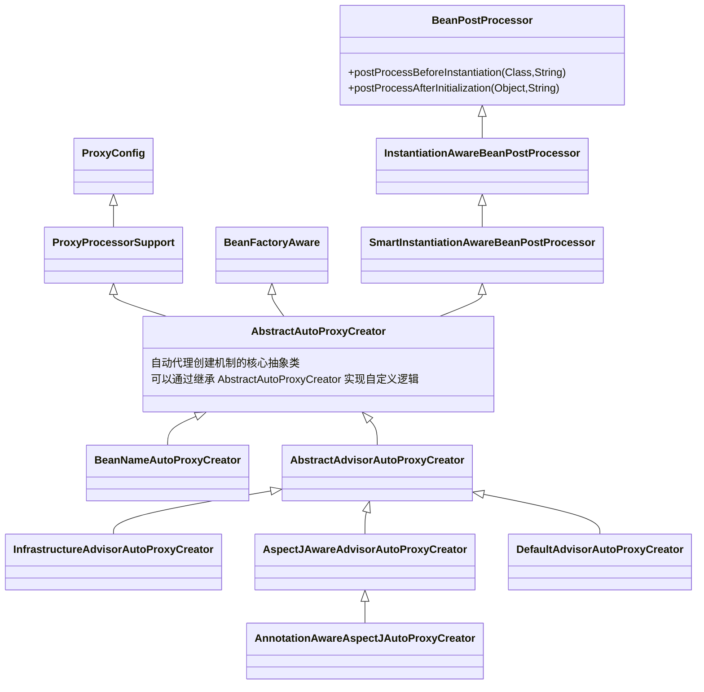
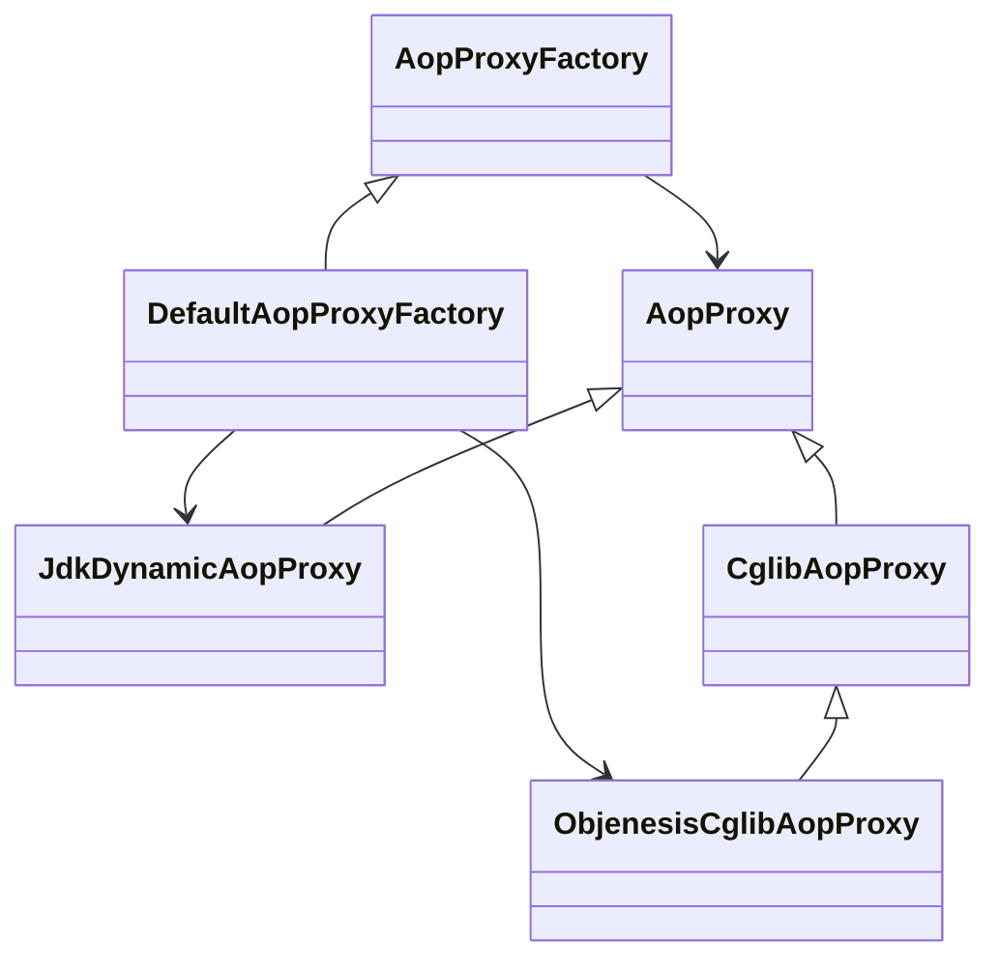

# Spring AOP 实现原理
[[toc]]

::: tip
AOP是基于IOC的Bean加载来实现的。
:::

## Spring AOP 初始化过程
1. 解析配置并创建`AspectJAwareAdvisorAutoProxyCreator`，分为XML配置、注解配置和自动注册三种方式，下面以XML配置为例介绍：
   1. Spring 容器解析 XML 配置文件的过程中会调用<Tip>AopNamespaceHandler.init()</Tip>
   2. `AopNamespaceHandler.init()`方法会注册`aop:aspectj-autoproxy`的解析类：<Tip>AspectJAutoProxyBeanDefinitionParser</Tip>
   3. `AspectJAutoProxyBeanDefinitionParser`的`parse()`方法创建了<Tip>AspectJAwareAdvisorAutoProxyCreator</Tip>
2. 创建代理：识别需要代理的Bean，如需代理返回代理对象，否则返回原始Bean
   1. `AspectJAwareAdvisorAutoProxyCreator`实现了接口`BeanPostProcessor`
   2. 创建代理的方法是`postProcessAfterInitialization`：如果bean被子类标识为代理，则使用配置的拦截器创建一个代理；否则返回原始Bean。
3. 生成代理：代理对象的实际创建/生成过程，Spring AOP支持两种代理方式：
   1. JDK动态代理
   2. CGLIB代理
4. 拦截器链构建
   1. 将各种通知类型（Before、After等）转换为MethodInterceptor
   2. 跟据通知的优先级和顺序注解(@Order)排序：@Around → @Before → @After → @AfterReturning/@AfterThrowing
   3. 代理对象增强：生成的代理对象内部包含原始对象和拦截器链，方法调用时，会按顺序执行拦截器链

初始化流程图如下：


### 解析配置并创建`AspectJAwareAdvisorAutoProxyCreator`


### 代理的创建

创建代理的方法是postProcessAfterInitialization：如果bean被子类标识为代理，则使用配置的拦截器创建一个代理：
```java
public Object postProcessAfterInitialization(@Nullable Object bean, String beanName) {
  if (bean != null) {
     Object cacheKey = this.getCacheKey(bean.getClass(), beanName);
     // 如果不是提前暴露的代理
     if (this.earlyProxyReferences.remove(cacheKey) != bean) {
        return this.wrapIfNecessary(bean, beanName, cacheKey);
     }
  }
  return bean;
}
```

wrapIfNecessary()方法用于判断是否需要创建代理，如果Bean能够获取到advisor才需要创建代理：
```java
protected Object wrapIfNecessary(Object bean, String beanName, Object cacheKey) {
  // 如果bean是通过TargetSource接口获取
  if (StringUtils.hasLength(beanName) && this.targetSourcedBeans.contains(beanName)) {
      return bean;
  }
  // 如果bean是切面类
  else if (Boolean.FALSE.equals(this.advisedBeans.get(cacheKey))) {
      return bean;
  }
  // 如果是aop基础类？是否跳过？
  else if (!this.isInfrastructureClass(bean.getClass()) && !this.shouldSkip(bean.getClass(), beanName)) {
      // 重点：获取所有advisor，如果没有获取到，那说明不要进行增强，也就不需要代理了。
      Object[] specificInterceptors = this.getAdvicesAndAdvisorsForBean(bean.getClass(), beanName, (TargetSource)null);      
      if (specificInterceptors != DO_NOT_PROXY) {
          this.advisedBeans.put(cacheKey, Boolean.TRUE);
          Object proxy = this.createProxy(bean.getClass(), beanName, specificInterceptors, new SingletonTargetSource(bean));
          this.proxyTypes.put(cacheKey, proxy.getClass());
          return proxy;
      } else {
          this.advisedBeans.put(cacheKey, Boolean.FALSE);
          return bean;
      }
  } else {
      this.advisedBeans.put(cacheKey, Boolean.FALSE);
      return bean;
  }
}
```

getAdvicesAndAdvisorsForBean()方法获取所有的Advisor:

```java

@Nullable
protected Object[] getAdvicesAndAdvisorsForBean(Class<?> beanClass, String beanName, @Nullable TargetSource targetSource) {
  List<Advisor> advisors = this.findEligibleAdvisors(beanClass, beanName);
  return advisors.isEmpty() ? DO_NOT_PROXY : advisors.toArray();
}

protected List<Advisor> findEligibleAdvisors(Class<?> beanClass, String beanName) {
  // 获取所有切面类的切面方法生成Advisor
  List<Advisor> candidateAdvisors = this.findCandidateAdvisors();
  // 找到能够应用于beanClass的Advisor
  List<Advisor> eligibleAdvisors = this.findAdvisorsThatCanApply(candidateAdvisors, beanClass, beanName);
  // 如果需要，交给子类拓展
  this.extendAdvisors(eligibleAdvisors);
  // 对Advisor排序
  if (!eligibleAdvisors.isEmpty()) {
    eligibleAdvisors = this.sortAdvisors(eligibleAdvisors);
  }

  return eligibleAdvisors;
}

protected List<Advisor> findCandidateAdvisors() {
  Assert.state(this.advisorRetrievalHelper != null, "No BeanFactoryAdvisorRetrievalHelper available");
  return this.advisorRetrievalHelper.findAdvisorBeans();
}

protected List<Advisor> findAdvisorsThatCanApply(List<Advisor> candidateAdvisors, Class<?> beanClass, String beanName) {
  ProxyCreationContext.setCurrentProxiedBeanName(beanName);

  List var4;
  try {
    var4 = AopUtils.findAdvisorsThatCanApply(candidateAdvisors, beanClass);
  } finally {
    ProxyCreationContext.setCurrentProxiedBeanName((String)null);
  }

  return var4;
}

```

### 代理的生成
获取所有advisor后，如果有advisor，则说明需要增强，即需要创建代理，`AbstractAdvisorAutoProxyCreator::createProxy()`方法是创建代理的入口方法：


核心方法是`DefaultAopProxyFactory::createAopProxy()`，根据依据条件创建jdk或cglib代理：
::: code-tabs#java
@tab AbstractAdvisorAutoProxyCreator
```java
protected Object createProxy(Class<?> beanClass, @Nullable String beanName, @Nullable Object[] specificInterceptors, TargetSource targetSource) {
    if (this.beanFactory instanceof ConfigurableListableBeanFactory) {
        AutoProxyUtils.exposeTargetClass((ConfigurableListableBeanFactory)this.beanFactory, beanName, beanClass);
    }
    // 创建代理工厂
    ProxyFactory proxyFactory = new ProxyFactory();
    proxyFactory.copyFrom(this);
    if (proxyFactory.isProxyTargetClass()) {
        if (Proxy.isProxyClass(beanClass) || ClassUtils.isLambdaClass(beanClass)) {
            Class[] var6 = beanClass.getInterfaces();
            int var7 = var6.length;

            for(int var8 = 0; var8 < var7; ++var8) {
                Class<?> ifc = var6[var8];
                proxyFactory.addInterface(ifc);
            }
        }
    } else if (this.shouldProxyTargetClass(beanClass, beanName)) {
        proxyFactory.setProxyTargetClass(true);
    } else {
        this.evaluateProxyInterfaces(beanClass, proxyFactory);
    }

    Advisor[] advisors = this.buildAdvisors(beanName, specificInterceptors);
    proxyFactory.addAdvisors(advisors);
    proxyFactory.setTargetSource(targetSource);
    this.customizeProxyFactory(proxyFactory);
    proxyFactory.setFrozen(this.freezeProxy);
    if (this.advisorsPreFiltered()) {
        proxyFactory.setPreFiltered(true);
    }

    ClassLoader classLoader = this.getProxyClassLoader();
    if (classLoader instanceof SmartClassLoader && classLoader != beanClass.getClassLoader()) {
        classLoader = ((SmartClassLoader)classLoader).getOriginalClassLoader();
    }

    return proxyFactory.getProxy(classLoader);
}
```
@tab ProxyFactory
```java
public Object getProxy(@Nullable ClassLoader classLoader) {
    return this.createAopProxy().getProxy(classLoader);
}
```
@tab ProxyCreatorSupport
```java
protected final synchronized AopProxy createAopProxy() {
    if (!this.active) {
        this.activate();
    }
    return this.getAopProxyFactory().createAopProxy(this);
}
public AopProxyFactory getAopProxyFactory() {
  return this.aopProxyFactory;
}
```

@tab DefaultAopProxyFactory
```java
public AopProxy createAopProxy(AdvisedSupport config) throws AopConfigException {
    // 没有优化 && 没有强制使用cglib代理 && 目标类实现了接口 时生成JDK动态代理
    // config.isProxyTargetClass()是通过<aop:config proxy-target-class="true" /> 来配置的，表示优先使用cglib代理，默认是false；
    if (NativeDetector.inNativeImage() 
        || !config.isOptimize() && !config.isProxyTargetClass() && !this.hasNoUserSuppliedProxyInterfaces(config)) {
        return new JdkDynamicAopProxy(config);
    } else {
        Class<?> targetClass = config.getTargetClass();
        if (targetClass == null) {
            throw new AopConfigException("TargetSource cannot determine target class: Either an interface or a target is required for proxy creation.");
        } else {
            // 目标类不是接口，不是代理类，不是Lambda表达式时生成Cglib代理，否则生成JDK动态代理
            return (AopProxy)(!targetClass.isInterface() && !Proxy.isProxyClass(targetClass) && !ClassUtils.isLambdaClass(targetClass) 
            ? new ObjenesisCglibAopProxy(config) : new JdkDynamicAopProxy(config));
        }
    }
}
```
:::


## 关键类解析
### AopNamespaceHandler
AopNamespaceHandler 注册了四个解析器，类图如下：

时序图如下：


### AbstractAutoProxyCreator
::: tip
AbstractAutoProxyCreator 是 Spring AOP 自动代理创建机制的核心抽象类，它实现了 Spring 容器中 Bean 的自动代理功能。
AbstractAutoProxyCreator 是一个 BeanPostProcessor，它会在 Spring 容器初始化 Bean 后，检查该 Bean 是否需要被代理（根据切面配置），并在需要时创建代理对象。
:::

#### 继承关系


AbstractAutoProxyCreator 实现了两个接口：
- BeanFactoryAware：BeanFactoryAware接口用于获取BeanFactory，并将BeanFactory注入到AbstractAutoProxyCreator中。
- SmartInstantiationAwareBeanPostProcessor：SmartInstantiationAwareBeanPostProcessor接口是BeanPostProcessor的子接口，核心方法是`postProcessBeforeInstantiation`和`postProcessAfterInitialization`：
   + `postProcessBeforeInstantiation`在Bean初始化后调用，决定是否创建代理   
主要子类及功能： 
- BeanNameAutoProxyCreator
   + 基于 Bean 名称的自动代理创建器
   + 通过配置 Bean 名称列表来决定哪些 Bean 需要代理
   + 不依赖 AspectJ 注解或 Pointcut 表达式
   + 适合简单的、基于名称的代理需求

- AbstractAdvisorAutoProxyCreator
   - AspectJAwareAdvisorAutoProxyCreator：支持 AspectJ 注解风格的切面定义的基础自动代理创建器，是 Spring AOP 自动代理创建器的基类，它的注册过程取决于 Spring 配置方式
      + 能够识别容器中的 Advisor Bean
      + 支持基于 Pointcut 的匹配
   - AnnotationAwareAspectJAutoProxyCreator：支持 AspectJ 注解风格的自动代理创建器（最常用的实现）
      + 匹配 `@Aspect` 或 `Advisor` 注解的切面类
      + 自动检测 @Before, @After, @Around 等注解
      + 是 @EnableAspectJAutoProxy 默认注册的类型
   - InfrastructureAdvisorAutoProxyCreator
      + 专门为 Spring 基础设施 Bean 提供自动代理支持。
      + 只处理带有 InfrastructureAdvisor 的 Bean
      + 通常用于 Spring 内部事务管理、缓存等基础设施
      + 不处理常规应用 @Aspect 切面
   - DefaultAdvisorAutoProxyCreator
      + 自动应用容器中所有的 Advisor
      + 不需要显式配置每个 Bean 的代理
      + 适合需要全局应用某些切面的场景

| 类名 | 代理触发条件 | 主要用途 | 支持注解 |
| ---- | ---- | ---- | ---- |
| BeanNameAutoProxyCreator | 匹配配置的 Bean 名称 | 简单名称匹配场景 | |
| AspectJAwareAdvisorAutoProxyCreator | 能够识别容器中的 Advisor Bean || |
| AnnotationAwareAspectJAutoProxyCreator |匹配 @Aspect 类或 Advisor| 常规应用 AOP | @Before, @After, @Around  |
| InfrastructureAdvisorAutoProxyCreator|匹配 InfrastructureAdvisor| Spring 内部基础设施 ||
| DefaultAdvisorAutoProxyCreator | 匹配所有 Advisor | 全局切面应用 | |

#### 注册过程

##### XML配置方式注册
当使用传统 XML 配置 AOP 时，注册发生在 <aop:config> 或 <aop:aspectj-autoproxy> 标签解析过程中：
1. 解析 aop 命名空间时，AopNamespaceHandler 会处理 <aop:aspectj-autoproxy> 标签
2. 调用 AspectJAutoProxyBeanDefinitionParser.parse() 方法
3. 最终注册 AnnotationAwareAspectJAutoProxyCreator
```java
class AspectJAutoProxyBeanDefinitionParser implements BeanDefinitionParser {
   @Nullable
   public BeanDefinition parse(Element element, ParserContext parserContext) {
      AopNamespaceUtils.registerAspectJAnnotationAutoProxyCreatorIfNecessary(parserContext, element);
      this.extendBeanDefinition(element, parserContext);
      return null;
   }
}
public abstract class AopNamespaceUtils {
   public static void registerAspectJAnnotationAutoProxyCreatorIfNecessary(ParserContext parserContext, Element sourceElement) {
      BeanDefinition beanDefinition = AopConfigUtils.registerAspectJAnnotationAutoProxyCreatorIfNecessary(parserContext.getRegistry(), parserContext.extractSource(sourceElement));
      useClassProxyingIfNecessary(parserContext.getRegistry(), sourceElement);
      registerComponentIfNecessary(beanDefinition, parserContext);
   }
}
```

##### 注解配置方式注册
使用 @EnableAspectJAutoProxy 注解时：
1. @EnableAspectJAutoProxy 注解通过 @Import(AspectJAutoProxyRegistrar.class) 引入注册逻辑
2. AspectJAutoProxyRegistrar 实现 ImportBeanDefinitionRegistrar 接口
3. 在 registerBeanDefinitions() 方法中注册 AnnotationAwareAspectJAutoProxyCreator

##### 自动注册机制
在 Spring Boot 中，自动配置会隐式注册：
1. 通过 spring-boot-autoconfigure 中的 AopAutoConfiguration 自动配置类
2. 当检测到存在 AOP 相关依赖时自动生效
3. 同样注册的是 AnnotationAwareAspectJAutoProxyCreator

##### 注册的具体位置
在 Spring 内部，所有路径最终都会调用 AopConfigUtils 工具类的`registerAspectJAnnotationAutoProxyCreatorIfNecessary`方法：
```java
public static BeanDefinition registerAspectJAnnotationAutoProxyCreatorIfNecessary(
    BeanDefinitionRegistry registry, Object source) {    
    return registerOrEscalateApcAsRequired(AnnotationAwareAspectJAutoProxyCreator.class, registry, source);
}
```

### AopProxyFactory & AopProxy
Spring AOP 中的 AopProxyFactory 和 AopProxy 是代理创建机制的核心接口，它们共同决定了 Spring 如何为目标对象创建代理。

#### AopProxyFactory
AopProxyFactory 是创建 AOP 代理的工厂接口，它根据配置决定使用 JDK 动态代理还是 CGLIB 代理。

#### AopProxy
常见实现类比较：
|特性及性能|JdkDynamicAopProxy|ObjenesisCglibAopProxy|
|----|----|----|
|实现原理|基于 JDK 动态代理实现|基于 CGLIB 字节码生成|
|创建方式|使用 java.lang.reflect.Proxy 创建|通过生成目标类的子类创建|
|目标类是否需要实现接口|需要|不需要|
|创建开销|低|高|
|调用性能|较高|略低|
|内存占用|低|较高|

选择建议：
- 优先 JDK 动态代理
- 当目标没有接口或需要代理非public方法时只能选择CGLIB

识别代理类型:
```java
if (AopUtils.isJdkDynamicProxy(bean)) {
    System.out.println("JDK动态代理");
} else if (AopUtils.isCglibProxy(bean)) {
    System.out.println("CGLIB代理");
}
```

常见问题：
- CGLIB 无法代理 final 方法
- CGLIB 代理对象需要额外处理序列化

### Advisor