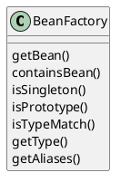
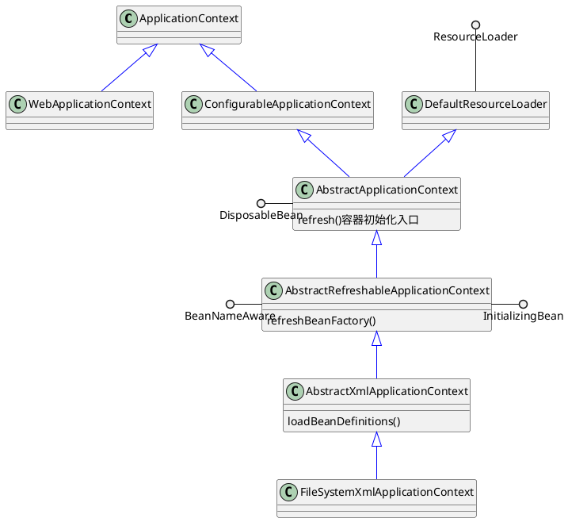
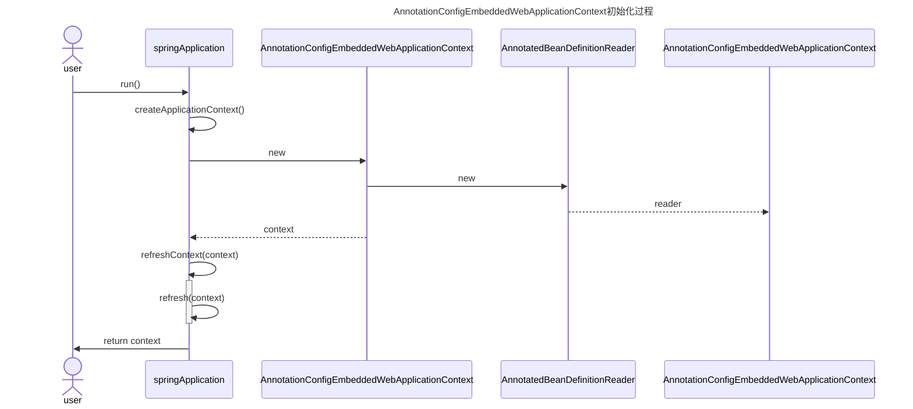
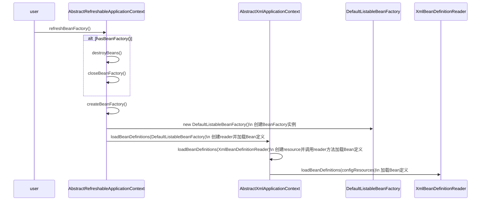
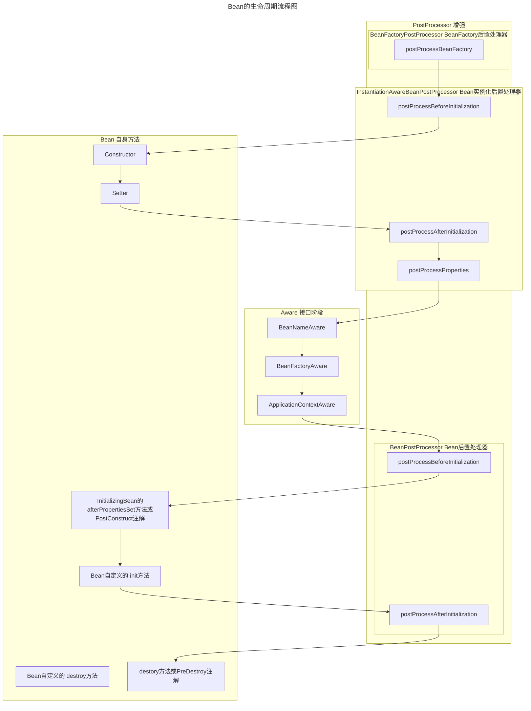

# Spring IoC 实现原理
[[toc]]
## IoC 体系结构设计
### BeanFactory 定义了IoC容器基本功能规范
BeanFactory 作为最顶层的接口，定义了IoC容器基本功能规范：
- getBean()：提供多个重载方法，根据bean名称、bean类型等参数获取bean实例
- containsBean(String name)：判断是否包含指定名称的bean
- isSingleton(String name)：判断bean是否为单例模式
- isPrototype(String name)：判断bean是否为原型模式
- isTypeMatch(String name, typeToMatch)：提供多个重载方法，判断bean类型是否匹配
- getType(String name)：获取bean类型
- getAliases(String name)：获取bean的别名
BeanFactory 有三个子类：ListableBeanFactory、HierarchicalBeanFactory 和AutowireCapableBeanFactory。
- ListableBeanFactory：提供了获取bean名称列表的功能
- HierarchicalBeanFactory：提供了获取父BeanFactory的功能
- AutowireCapableBeanFactory：提供了自动装配功能


### BeanDefinition定义Bean对象及其依赖关系
BeanDefinitionReader 是 BeanDefinition的解析器。  
BeanDefinitionHolder 是 BeanDefination的包装类，用来存储BeanDefinition，name以及aliases等。

### BeanRegistry 将Bean注册到IoC容器中
### ApplicationContext 继承BeanFactory，提供更多功能
从ApplicationContext的继承关系分析ApplicationContext的功能：
- ApplicationEventPublisher：提供应用事件发布功能，包括容器启动事件、关闭事件等。
  + 实现了 ApplicationListener 事件监听接口的 Bean 可以接收到容器事件 ， 并对事件进行响应处理 。
- LifeCycle：提供了容器生命周期管理功能，包括容器启动、停止等。
- MessageSource：提供国际化消息访问功能
- ResourceLoader：提供资源加载功能
  
围绕着是否需要Refresh容器衍生出两个抽象类，根据不同的资源加载方式，衍生出了众多ApplicationContext的实现类，常见的ApplicationContext实现类有：
- AbstractRefreshableApplicationContext：提供了容器刷新功能
  + AbstractXmlApplicationContext xml相关的实现类
    * FileSystemXmlApplicationContext
    * ClassPathXmlApplicationContext
  + AbstractRefreshableWebApplicationContext web相关的实现类
    * AnnotationConfigWebApplicationContext
    * XmlWebApplicationContext    
    * GroovyWebApplicationContext
- GenericApplicationContext：提供了容器基本功能，不提供刷新功能
  + AnnotationConfigApplicationContext 
  + GenericXXX和StaticXXX 包括web相关的实现类和xml相关的实现类

注：
- AnnotationConfigApplicationContext不支持刷新功能，因为基于注解的配置，是不太会被运行时修改的
- xml相关的常用实现类支持刷新功能，因为配置文件是容易修改的，需要支持刷新功能


## IoC 容器初始化过程
下面介绍BeanFactory容器和ApplicationContext容器的初始化过程。虽然BeanFactory容器是ApplicationContext容器的子集，但为了方便直观理解BeanFactory的初始化过程，还是单独介绍BeanFactory的初始化过程。
:::tip
BeanFactory 采用懒加载机制创建Bean实例，因此Bean的实例化过程发生在getBean()方法调用时。  
ApplicationContext会在容器初始化时创建所有非懒加载的Bean实例，所以Bean的实例化也属于ApplicationContext初始化过程的一部分。  
Bean的实例化过程比较多，放在下一节介绍，本节只介绍容器初始化主流程。
:::
### BeanFactory 容器初始化
BeanFactory 容器初始化过程主要分为以下几个步骤：
1. 创建BeanFactory实例（通常为 DefaultListableBeanFactory）
2. 创建并配置读取器 BeanDefinitionReader
3. 加载配置并注册Bean定义 `reader.loadBeanDefinitions()`
    1. ResourceLoader 加载资源
    2. BeanDefinitionReader 解析配置，生成 BeanDefinition
    3. BeanDefinitionRegistry 将 BeanDefinition 注册到IoC容器中
4. 按需初始化 Bean 实例（放在[Bean 实例化](#bean-实例化)介绍）

```java
// 1. 创建工厂
DefaultListableBeanFactory factory = new DefaultListableBeanFactory();

// 2. 创建读取器
XmlBeanDefinitionReader reader = new XmlBeanDefinitionReader(factory);

// 3. 加载配置
reader.loadBeanDefinitions(new ClassPathResource("beans.xml"));

// 4. 获取Bean（此时才初始化）
MyBean bean = factory.getBean(MyBean.class);
```


#### 设置资源解析器和环境
#### 设置配置路径
### ApplicationContext 容器初始化
ApplicationContext有多个实现类，这些容器的初始化流程在细节上有差别，但大体流程相同，下面按照以下顺序介绍ApplicationContext容器的初始化过程：
1. 首先介绍ApplicationContext初始化流程框架。
1. 然后以AnnotationConfigEmbeddedWebApplicationContext和ClasspathXmlApplicationContext为例介绍具体容器初始化过程。
1. 最后介绍ApplicationContext初始化过程的核心方法refresh()。
#### ApplicationContext 容器初始化框架
核心步骤：
1. 创建BeanFactory实例
2. 创建Reader实例
3. 调用`refresh()`方法
4. 返回ApplicationContext实例
:::tip
AbstractRefreshableApplicationContext可省略步骤1和步骤2，会在`refresh() -> obtainFreshBeanFactory() -> refreshBeanFactory()`方法中创建BeanFactory实例
:::
#### AnnotationConfigEmbeddedWebApplicationContext初始化过程
在`SpringApplication::run()`方法中<Tip> 1.5.13版本</Tip>简化版本的初始化过程如下：
1. 创建`AnnotationConfigEmbeddedWebApplicationContext`实例
   1. 创建`AnnotatedBeanDefinitionReader`实例  <Tip>核心步骤2</Tip>  
   1. 父类构造函数`GenericApplicationContext()`中创建`BeanFactory`实例 <Tip>核心步骤1</Tip>
2. 刷新上下文 `refreshContext(context)`  
   1. 调用`refresh(context)`方法  
      1. context.refresh() <Tip>核心步骤3</Tip>
3. 返回`ApplicationContext`实例  <Tip>核心步骤4</Tip>
时序图如下：
   create AnnotationConfigEmbeddedWebApplicationContext
   create AnnotatedBeanDefinitionReader

简化版本的代码如下：
```java
public ConfigurableApplicationContext run(String... args) {
    ......
    context = createApplicationContext();
    refreshContext(context);
    return context;
}

protected ConfigurableApplicationContext createApplicationContext() {
    Class<?> contextClass = this.applicationContextClass;
    if (contextClass == null) {
      try {
        contextClass = Class.forName(this.webEnvironment
        ? DEFAULT_WEB_CONTEXT_CLASS : DEFAULT_CONTEXT_CLASS);
      }
      catch (ClassNotFoundException ex) {
        throw new IllegalStateException(
        "Unable create a default ApplicationContext, "
        + "please specify an ApplicationContextClass",
        ex);
      }
    }
    return (ConfigurableApplicationContext) BeanUtils.instantiate(contextClass);
}

private void refreshContext(ConfigurableApplicationContext context) {
  refresh(context);
  if (this.registerShutdownHook) {
    try {
        context.registerShutdownHook();
    }
    catch (AccessControlException ex) {
        // Not allowed in some environments.
    }
  }
}
```

AnnotationConfigEmbeddedWebApplicationContext的构造方法中创建了AnnotatedBeanDefinitionReader：
```java
public AnnotationConfigEmbeddedWebApplicationContext() {
  this.reader = new AnnotatedBeanDefinitionReader(this);
  this.scanner = new ClassPathBeanDefinitionScanner(this);
}
```
#### ClasspathXmlApplicationContext初始化过程
ClasspathXmlApplicationContext可以在代码中直接创建，初始化过程放在了构造函数中：
```java
public ClassPathXmlApplicationContext(String... configLocations) throws BeansException {
    this(configLocations, true, (ApplicationContext)null);
}
public ClassPathXmlApplicationContext(String[] configLocations, boolean refresh, @Nullable ApplicationContext parent) throws BeansException {
  super(parent);
  this.setConfigLocations(configLocations);
  if (refresh) {
    this.refresh();
  }
}
```
1. 调用父类的构造方法，设置id、name、资源加载器等属性，合并父容器的Environment
2. 设置配置路径`setConfigLocations`
3. 初始化容器`refresh()` <Tip>核心步骤3</Tip>
    - `AbstractApplicationContext::obtainFreshBeanFactory()`<Tip></Tip>
      + `AbstractRefreshableApplicationContext::refreshBeanFactory()` <Tip>子类扩展点</Tip>
        * `AbstractRefreshableApplicationContext::createBeanFactory()` <Tip>子类扩展点</Tip>
          - 创建 DefaultListableBeanFactory <Tip>核心步骤1</Tip>
        * `AbstractXmlApplicationContext::loadBeanDefinitions(beanFactory)` <Tip>子类扩展点</Tip>
          - 创建`XmlBeanDefinitionReader`实例<Tip>核心步骤2</Tip>
:::tip
ClasspathXmlApplicationContext并没有显示创建BeanFactory实例和Reader实例，在`refresh() -> obtainFreshBeanFactory() -> refreshBeanFactory()`方法中传教。
:::
            
#### 核心方法refresh()
`refresh()` 方法是Spring容器初始化的核心，主要完成以下工作：
1. 准备刷新 `prepareRefresh()` 
2. 创建/刷新 BeanFactory  `obtainFreshBeanFactory()`
3. 准备BeanFactory `prepareBeanFactory`
    - 设置类加载器、表达式解析器、属性编辑器注册器、Bean后置处理器、忽略的依赖接口
    - 注册可解析的依赖、早期后置处理器
4. 执行 BeanFactory 后置处理 
    - `postProcessBeanFactory()`
      + 模板方法，子类可以通过覆盖 postProcessBeanFactory() 添加专有逻辑
    - `invokeBeanFactoryPostProcessors()`
      + 具体实现方法，执行所有注册的BeanFactoryPostProcessor的核心逻辑
5. 注册 Bean 后置处理器 `registerBeanPostProcessors()`
6. 初始化消息源 `initMessageSource()`
7. 初始化事件广播器 `initApplicationEventMulticaster()`
8. 刷新（模板方法，子类扩展点） `onRefresh()`
7. 注册监听器 `registerListeners()`  
8. 完成 BeanFactory 初始化（实例化所有非懒加载的单例Bean） `finishBeanFactoryInitialization()`
9. 完成刷新并发布相应事件 `finishRefresh()` 

##### 准备刷新 `prepareRefresh()`
```java
protected void prepareRefresh() {
  // 记录启动时间
  this.startupDate = System.currentTimeMillis();

  // 设置容器状态为活跃
  this.closed.set(false);
  this.active.set(true);

  // 初始化属性源
  // Initialize any placeholder property sources in the context environment
  initPropertySources();

  // 验证必要的属性
  // Validate that all properties marked as required are resolvable
  // see ConfigurablePropertyResolver#setRequiredProperties
  getEnvironment().validateRequiredProperties();

  // 存储早期应用事件
  // Allow for the collection of early ApplicationEvents,
  // to be published once the multicaster is available...
  this.earlyApplicationEvents = new LinkedHashSet<ApplicationEvent>();
}
```
#### 获取/刷新BeanFactory `obtainFreshBeanFactory()`
围绕着是否需要Refresh容器衍生出两个抽象类：
- AbstractRefreshableApplicationContext：提供了容器刷新功能，执行`refreshBeanFactory()`方法会创建新BeanFactory并加载定义
- GenericApplicationContext：提供了容器基本功能，不提供刷新功能，执行`refreshBeanFactory()`方法仅验证状态，不重建BeanFactory
:::tip
这里的刷新功能有点绕，和`refreshBeanFactory()`方法中的刷新含义不太一样：
- 提供Refresh功能的ApplicationContext，在`refreshBeanFactory()`方法中重建BeanFactory。 
- 不提供Refresh功能的ApplicationContext，在`refreshBeanFactory()`方法中仅验证状态。
:::
```java
protected ConfigurableListableBeanFactory obtainFreshBeanFactory() {
  // 1. 如果是GenericApplicationContext，刷新内部BeanFactory
  // 2. 如果是AbstractRefreshableApplicationContext，创建新BeanFactory并加载定义
  refreshBeanFactory();
  return getBeanFactory();;
}
```
##### AbstractRefreshableApplicationContext::refreshBeanFactory()
创建新BeanFactory并加载Bean定义：
1. 判断BeanFactory是否存在，如果存在则销毁
2. 创建新BeanFactory实例 `createBeanFactory()`
3. 创建Reader并加载Bean定义 `loadBeanDefinitions()` 
   - 子类扩展点,以AbstractXmlApplicationContext为例说明：
   - **new XmlBeanDefinitionReader(beanFactory) 创建XmlBeanDefinitionReader**
   - loadBeanDefinitions(beanDefinitionReader)
     + **reader.loadBeanDefinitions(configResources) 加载Bean定义**
:::tip
这里初始化 BeanFactory 的过程和 BeanFactory 容器初始化中的创建过程类似，只是分散在不同的方法中。
:::

```java [AbstractRefreshableApplicationContext]
protected final void refreshBeanFactory() throws BeansException {
  if (hasBeanFactory()) {
    destroyBeans();
    closeBeanFactory();
  }
  try {
    DefaultListableBeanFactory beanFactory = createBeanFactory();
    beanFactory.setSerializationId(getId());
    customizeBeanFactory(beanFactory);
    loadBeanDefinitions(beanFactory);
    synchronized (this.beanFactoryMonitor) {
      this.beanFactory = beanFactory;
    }
  }
  catch (IOException ex) {
    throw new ApplicationContextException("I/O error parsing bean definition source for " + getDisplayName(), ex);
  }
}

protected DefaultListableBeanFactory createBeanFactory() {
  return new DefaultListableBeanFactory(getInternalParentBeanFactory());
}
```
`loadBeanDefinitions(DefaultListableBeanFactory)`是模板方法，子类通过覆盖该方法实现加载Bean定义，以AbstractXmlApplicationContext为例说明：
```java [AbstractXmlApplicationContext]
protected void loadBeanDefinitions(DefaultListableBeanFactory beanFactory) throws BeansException, IOException {
    XmlBeanDefinitionReader beanDefinitionReader = new XmlBeanDefinitionReader(beanFactory);
    beanDefinitionReader.setEnvironment(this.getEnvironment());
    beanDefinitionReader.setResourceLoader(this);
    beanDefinitionReader.setEntityResolver(new ResourceEntityResolver(this));
    this.initBeanDefinitionReader(beanDefinitionReader);
    this.loadBeanDefinitions(beanDefinitionReader);
}

protected void loadBeanDefinitions(XmlBeanDefinitionReader reader) throws BeansException, IOException {
    Resource[] configResources = this.getConfigResources();
    if (configResources != null) {
        reader.loadBeanDefinitions(configResources);
    }

    String[] configLocations = this.getConfigLocations();
    if (configLocations != null) {
        reader.loadBeanDefinitions(configLocations);
    }

}
```
#### 准备BeanFactory `prepareBeanFactory`
```java
protected void prepareBeanFactory(ConfigurableListableBeanFactory beanFactory) {
  // 设置类加载器
  // Tell the internal bean factory to use the context's class loader etc.
  beanFactory.setBeanClassLoader(getClassLoader());
  
  // 设置表达式解析器
  beanFactory.setBeanExpressionResolver(new StandardBeanExpressionResolver(beanFactory.getBeanClassLoader()));
  
  // 设置属性编辑器注册器
  beanFactory.addPropertyEditorRegistrar(new ResourceEditorRegistrar(this, getEnvironment()));

  // 添加Bean后置处理器
  // Configure the bean factory with context callbacks.
  beanFactory.addBeanPostProcessor(new ApplicationContextAwareProcessor(this));
  
  // 设置忽略的依赖接口
  beanFactory.ignoreDependencyInterface(EnvironmentAware.class);
  beanFactory.ignoreDependencyInterface(EmbeddedValueResolverAware.class);
  beanFactory.ignoreDependencyInterface(ResourceLoaderAware.class);
  beanFactory.ignoreDependencyInterface(ApplicationEventPublisherAware.class);
  beanFactory.ignoreDependencyInterface(MessageSourceAware.class);
  beanFactory.ignoreDependencyInterface(ApplicationContextAware.class);

  // 注册可解析的依赖
  // BeanFactory interface not registered as resolvable type in a plain factory.
  // MessageSource registered (and found for autowiring) as a bean.
  beanFactory.registerResolvableDependency(BeanFactory.class, beanFactory);
  beanFactory.registerResolvableDependency(ResourceLoader.class, this);
  beanFactory.registerResolvableDependency(ApplicationEventPublisher.class, this);
  beanFactory.registerResolvableDependency(ApplicationContext.class, this);

  // 注册早期后置处理器
  // Register early post-processor for detecting inner beans as ApplicationListeners.
  beanFactory.addBeanPostProcessor(new ApplicationListenerDetector(this));

  // Detect a LoadTimeWeaver and prepare for weaving, if found.
  if (beanFactory.containsBean(LOAD_TIME_WEAVER_BEAN_NAME)) {
    beanFactory.addBeanPostProcessor(new LoadTimeWeaverAwareProcessor(beanFactory));
    // Set a temporary ClassLoader for type matching.
    beanFactory.setTempClassLoader(new ContextTypeMatchClassLoader(beanFactory.getBeanClassLoader()));
  }

  // Register default environment beans.
  if (!beanFactory.containsLocalBean(ENVIRONMENT_BEAN_NAME)) {
    beanFactory.registerSingleton(ENVIRONMENT_BEAN_NAME, getEnvironment());
  }
  if (!beanFactory.containsLocalBean(SYSTEM_PROPERTIES_BEAN_NAME)) {
    beanFactory.registerSingleton(SYSTEM_PROPERTIES_BEAN_NAME, getEnvironment().getSystemProperties());
  }
  if (!beanFactory.containsLocalBean(SYSTEM_ENVIRONMENT_BEAN_NAME)) {
    beanFactory.registerSingleton(SYSTEM_ENVIRONMENT_BEAN_NAME, getEnvironment().getSystemEnvironment());
  }
}
```
#### 执行 BeanFactory 后置处理 `postProcessBeanFactory()`
供子类扩展的钩子方法，在BeanFactory准备完成后，处理器执行前调用，是子类添加特定的BeanFactory初始化逻辑。典型子类实现：
- GenericWebApplicationContext：添加ServletContext相关处理器
- AnnotationConfigWebApplicationContext：注册配置类后置处理器
#### 调用 BeanFactory 后置处理器 `invokeBeanFactoryPostProcessors()`
委托给PostProcessorRegistrationDelegate执行，实例化并调用所有已注册的BeanFactoryPostProcessor，包含完整的执行逻辑，通常不需要子类覆盖：
- 先执行 BeanDefinitionRegistryPostProcessor 的 postProcessBeanDefinitionRegistry()
- 再执行 BeanFactoryPostProcessor 的 postProcessBeanFactory()
- 按照优先级顺序执行（PriorityOrdered > Ordered > 普通）

```java
protected void invokeBeanFactoryPostProcessors(ConfigurableListableBeanFactory beanFactory) {
  // 委托给PostProcessorRegistrationDelegate执行
  PostProcessorRegistrationDelegate.invokeBeanFactoryPostProcessors(beanFactory, getBeanFactoryPostProcessors());

  // 检测LoadTimeWeaver并准备编织
  // Detect a LoadTimeWeaver and prepare for weaving, if found in the meantime
  // (e.g. through an @Bean method registered by ConfigurationClassPostProcessor)
  if (beanFactory.getTempClassLoader() == null && beanFactory.containsBean(LOAD_TIME_WEAVER_BEAN_NAME)) {
    beanFactory.addBeanPostProcessor(new LoadTimeWeaverAwareProcessor(beanFactory));
    beanFactory.setTempClassLoader(new ContextTypeMatchClassLoader(beanFactory.getBeanClassLoader()));
  }
}

```
#### 注册 Bean 后置处理器 `registerBeanPostProcessors()`
委托给PostProcessorRegistrationDelegate执行，注册Bean后置处理器。
```java
protected void registerBeanPostProcessors(ConfigurableListableBeanFactory beanFactory) {
    PostProcessorRegistrationDelegate.registerBeanPostProcessors(beanFactory, this);
}
```
### BeanFactory VS ApplicationContext
通过BeanFactory和ApplicationContext的初始化过程，可以看出BeanFactory和ApplicationContext的区别：
- BeanFactory：提供了IoC容器基本功能，加载资源、解析配置、注册Bean，但不提供生命周期管理和事件发布功能。
- ApplicationContext：继承BeanFactory，提供了生命周期管理和事件发布功能。

||BeanFactory|	ApplicationContext|
|-|-|-|
|后置处理器	| 需要手动注册|	自动检测并注册|
|AOP支持|需手动配置ProxyFactoryBean|自动代理创建|
|事件机制|不支持|内置支持|

## Bean 实例化
IoC 容器初始化实现了将资源文件的元数据转换为BeanDefinition，并将BeanDefinition注册到IoC容器中，Bean实例化的过程就是从IoC容器中根据BeanDefinition获取Bean实例的过程。
实例化过程主要分为以下几个步骤：
1. 根据BeanDefinition的配置信息，创建Bean实例
2. 处理Bean的依赖关系，将依赖的Bean注入到Bean实例中
3. 调用Bean的初始化方法，完成Bean的实例化
4. 将Bean实例注册到IoC容器中

### 创建Bean实例
BeanFactory会在调用getBean()方法时创建Bean实例。

#### getBean()方法
getBean()方法的实现主要分为以下几个步骤：
1. 解析bean的真正name，如果bean是工厂类，name会增加前缀`&`，需去掉
2. 无参单例尝试从缓存中获取Bean实例
3. 如果bean实例还在创建中，直接抛异常
4. 如果bean definition 存在于父的bean工厂中，委派给父Bean工厂获取
5. 标记这个beanName的实例正在创建   
6. 根据Bean名称从IoC容器中获取BeanDefinition
7. 初始化它依赖的Bean
8. 创建bean实例，按照单例、原型、scope等不同模式创建实例
   - 单例：
   - 原型：
   - scope：
     

从BeanDefinition中获取Bean的类名
通过反射机制创建Bean实例
  - getConstructorArgumentValues()：获取Bean的构造方法参数值
  - getPropertyValue()：获取Bean的属性值
返回Bean实例

4. 处理Bean的依赖关系，将依赖的Bean注入到Bean实例中

### 循环依赖
Spring只解决了单例模式下属性依赖的循环问题。
#### 单例模式下属性循环依赖的解决方案
Spring 使用三个缓存层存储不同状态的 Bean：
- 一级缓存（单例池） singletonObjects：存放完全初始化好的 Bean。
- 二级缓存 earlySingletonObjects：存放提前暴露的半成品 Bean（已实例化但未填充属性）。
- 三级缓存 singletonFactories：存放 Bean 的工厂对象，用于生成半成品 Bean。

解决流程（以 A → B → A 为例）：
1. 创建 A：实例化 A，将 A 的工厂对象放入三级缓存。
2. 填充 A 的属性：发现需要注入 B，开始创建 B。
3. 创建 B： 实例化 B，将 B 的工厂对象放入三级缓存。
4. 解决依赖：填充 B 的属性，发现需要注入 A：
   - 从三级缓存中找到 A 的工厂，生成半成品 A 并放入二级缓存。
   - 将半成品 A 注入 B，完成 B 的初始化。
   - 将 B 放入一级缓存。
5. 完成A的初始化：
   - 将初始化好的 B 注入 A
   - 将 A 放入一级缓存。
#### 非单例属性之外的循环依赖
构造器循环依赖
  - 改为Setter/字段注入
  - 使用@Lazy注解，延迟加载
使用@DependsOn注解，指定加载先后关系，避免循环依赖
多例循环依赖
  - 改为单例模式
### Bean生命周期
#### 流程
<!--
```flow
st=>start: 开始
e=>end: 结束
postProcessBeanFactory=>operation: postProcessBeanFactory BeanFactory后置处理，不属于特定Bean生命周期

BeforeInitialization=>operation: postProcessBeforeInitialization
Initialization=>operation: Bean实例化、给属性赋值
postProcessAfterInitialization=>operation: postProcessAfterInitialization
postProcessProperties=>operation: postProcessProperties

setBeanName=>operation: setBeanName
setBeanFactory=>operation: setBeanFactory
setApplicationContext=>operation: setApplicationContext

BeforeInitialization2=>operation: postProcessBeforeInitialization
afterPropertiesSet=>operation: afterPropertiesSet
init=>operation: init或@PostConstruct
AfterInitialization2=>operation: postProcessAfterInitialization
destroy=>operation: destroy或@PreDestroy
st->postProcessBeanFactory->BeforeInitialization->Initialization->postProcessAfterInitialization->postProcessProperties->setBeanName->setBeanFactory->setApplicationContext->BeforeInitialization2->init->AfterInitialization2->destroy->e
```
-->




    